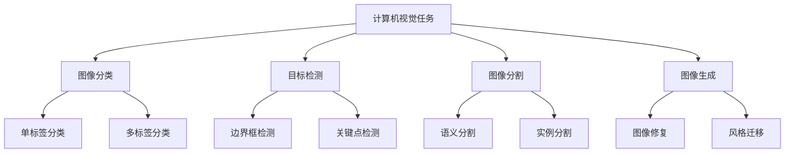

# 图像识别应用实践：从理论到部署

计算机视觉是AI最具影响力的应用领域之一，图像识别是其核心技术。本文将从CNN原理出发，逐步深入到现代预训练模型和实际部署，构建完整的实践知识体系。

## 一、计算机视觉概述

### 1.1 核心任务



### 1.2 技术演进

| 阶段 | 时间 | 代表技术 | 特点 |
|------|------|---------|------|
| 传统方法 | 2000前 | SIFT、HOG | 手工特征，规则驱动 |
| 深度学习初期 | 2012-2015 | AlexNet、VGG | CNN兴起，性能突破 |
| 现代架构 | 2015- | ResNet、EfficientNet | 深层网络、高效架构 |
| 预训练时代 | 2018- | Vision Transformer | 大规模预训练 |

## 二、卷积神经网络（CNN）

### 2.1 CNN核心组件

**卷积层**：
通过卷积核提取局部特征：

```python
import torch
import torch.nn as nn
import numpy as np
import matplotlib.pyplot as plt

# 卷积操作示例
conv_layer = nn.Conv2d(in_channels=1, out_channels=3, kernel_size=3, stride=1, padding=1)

# 生成示例图像（灰度）
image = torch.randn(1, 1, 5, 5)
output = conv_layer(image)

print(f"输入图像维度: {image.shape}")
print(f"卷积输出维度: {output.shape}")
print(f"卷积核参数: {conv_layer.weight.shape}")
```

**关键参数**：
- `kernel_size`: 卷积核大小（常用3x3, 5x5）
- `stride`: 步长（控制输出大小）
- `padding`: 填充（保持尺寸）
- `in_channels/out_channels`: 输入/输出通道数

### 2.2 激活与池化

```python
import torch.nn.functional as F

# ReLU激活函数
relu = nn.ReLU()

# 池化层（降采样）
max_pool = nn.MaxPool2d(kernel_size=2, stride=2)
avg_pool = nn.AvgPool2d(kernel_size=2, stride=2)

# 示例
feature_map = torch.randn(1, 3, 8, 8)
pooled_max = max_pool(feature_map)
pooled_avg = avg_pool(feature_map)

print(f"原始特征图: {feature_map.shape}")
print(f"最大池化后: {pooled_max.shape}")
print(f"平均池化后: {pooled_avg.shape}")
```

### 2.3 经典CNN架构

**LeNet-5（1998）**：

```python
class LeNet5(nn.Module):
    def __init__(self, num_classes=10):
        super(LeNet5, self).__init__()
        self.conv1 = nn.Conv2d(1, 6, kernel_size=5)
        self.conv2 = nn.Conv2d(6, 16, kernel_size=5)
        self.fc1 = nn.Linear(16*5*5, 120)
        self.fc2 = nn.Linear(120, 84)
        self.fc3 = nn.Linear(84, num_classes)
        
    def forward(self, x):
        x = F.relu(self.conv1(x))
        x = F.max_pool2d(x, 2)
        x = F.relu(self.conv2(x))
        x = F.max_pool2d(x, 2)
        x = x.view(x.size(0), -1)
        x = F.relu(self.fc1(x))
        x = F.relu(self.fc2(x))
        x = self.fc3(x)
        return x

lenet = LeNet5()
print("LeNet-5架构:")
print(lenet)
```

**AlexNet（2012）**：

```python
class AlexNet(nn.Module):
    def __init__(self, num_classes=1000):
        super(AlexNet, self).__init__()
        self.features = nn.Sequential(
            nn.Conv2d(3, 64, kernel_size=11, stride=4, padding=2),
            nn.ReLU(inplace=True),
            nn.MaxPool2d(kernel_size=3, stride=2),
            
            nn.Conv2d(64, 192, kernel_size=5, padding=2),
            nn.ReLU(inplace=True),
            nn.MaxPool2d(kernel_size=3, stride=2),
            
            nn.Conv2d(192, 384, kernel_size=3, padding=1),
            nn.ReLU(inplace=True),
            
            nn.Conv2d(384, 256, kernel_size=3, padding=1),
            nn.ReLU(inplace=True),
            
            nn.Conv2d(256, 256, kernel_size=3, padding=1),
            nn.ReLU(inplace=True),
            nn.MaxPool2d(kernel_size=3, stride=2),
        )
        
        self.classifier = nn.Sequential(
            nn.Dropout(0.5),
            nn.Linear(256 * 6 * 6, 4096),
            nn.ReLU(inplace=True),
            
            nn.Dropout(0.5),
            nn.Linear(4096, 4096),
            nn.ReLU(inplace=True),
            
            nn.Linear(4096, num_classes),
        )
        
    def forward(self, x):
        x = self.features(x)
        x = x.view(x.size(0), -1)
        x = self.classifier(x)
        return x
```

## 三、现代CNN架构

### 3.1 ResNet

ResNet通过残差连接解决深层网络训练问题：

**残差块原理**：
```
y = F(x) + x  # 跳跃连接
```

```python
class ResidualBlock(nn.Module):
    def __init__(self, in_channels, out_channels, stride=1):
        super(ResidualBlock, self).__init__()
        
        self.conv1 = nn.Conv2d(in_channels, out_channels, kernel_size=3, 
                               stride=stride, padding=1, bias=False)
        self.bn1 = nn.BatchNorm2d(out_channels)
        
        self.conv2 = nn.Conv2d(out_channels, out_channels, kernel_size=3,
                               stride=1, padding=1, bias=False)
        self.bn2 = nn.BatchNorm2d(out_channels)
        
        self.relu = nn.ReLU(inplace=True)
        
        # 调整维度以匹配
        self.shortcut = nn.Sequential()
        if stride != 1 or in_channels != out_channels:
            self.shortcut = nn.Sequential(
                nn.Conv2d(in_channels, out_channels, kernel_size=1,
                         stride=stride, bias=False),
                nn.BatchNorm2d(out_channels)
            )
    
    def forward(self, x):
        identity = self.shortcut(x)
        
        out = self.conv1(x)
        out = self.bn1(out)
        out = self.relu(out)
        
        out = self.conv2(out)
        out = self.bn2(out)
        
        out += identity  # 残差连接
        out = self.relu(out)
        
        return out

residual_block = ResidualBlock(64, 64)
print("\n残差块:")
print(residual_block)
```

### 3.2 VGG

VGG通过堆叠小卷积核（3x3）构建深层网络：

```python
class VGGBlock(nn.Module):
    def __init__(self, in_channels, out_channels, num_convs):
        super(VGGBlock, self).__init__()
        layers = []
        for _ in range(num_convs):
            layers.append(nn.Conv2d(in_channels, out_channels, kernel_size=3, padding=1))
            layers.append(nn.ReLU(inplace=True))
            in_channels = out_channels
        layers.append(nn.MaxPool2d(kernel_size=2, stride=2))
        self.block = nn.Sequential(*layers)
    
    def forward(self, x):
        return self.block(x)

# VGG16风格架构
vgg16 = nn.Sequential(
    VGGBlock(3, 64, 2),
    VGGBlock(64, 128, 2),
    VGGBlock(128, 256, 3),
    VGGBlock(256, 512, 3),
    VGGBlock(512, 512, 3),
)

print("\nVGG16风格:")
print(vgg16)
```

### 3.3 EfficientNet

EfficientNet通过复合缩放优化效率：

```python
# EfficientNet核心思想：同时缩放深度、宽度、分辨率
def efficientnet_config(version='B0'):
    # 预定义配置
    configs = {
        'B0': {'depth': 18, 'width': 1.0, 'resolution': 224},
        'B1': {'depth': 20, 'width': 1.0, 'resolution': 240},
        'B7': {'depth': 66, 'width': 2.0, 'resolution': 600}
    }
    return configs[version]

config = efficientnet_config('B0')
print(f"\nEfficientNet-B0配置: {config}")
```

## 四、目标检测

### 4.1 检测任务分类

| 类型 | 方法 | 输出 |
|------|------|------|
| 单阶段检测 | YOLO、SSD | 直接预测边界框 |
| 两阶段检测 | Faster R-CNN | 先提取候选区域再分类 |

### 4.2 YOLO原理

YOLO将检测视为回归问题，单次前向传播完成：

```python
# YOLO简化实现（示意）
class SimpleYOLO(nn.Module):
    def __init__(self, num_classes=20):
        super(SimpleYOLO, self).__init__()
        # 基础卷积网络
        self.features = nn.Sequential(
            nn.Conv2d(3, 64, kernel_size=3, stride=1, padding=1),
            nn.ReLU(),
            nn.MaxPool2d(2, 2),
            
            nn.Conv2d(64, 128, kernel_size=3, stride=1, padding=1),
            nn.ReLU(),
            nn.MaxPool2d(2, 2),
        )
        
        # 检测头（边界框 + 类别）
        # 每个网格预测：5个参数（x,y,w,h,confidence） + num_classes
        self.detect = nn.Conv2d(128, 5 + num_classes, kernel_size=1)
        
    def forward(self, x):
        features = self.features(x)
        detections = self.detect(features)
        return detections

yolo = SimpleYOLO(num_classes=20)
print("\n简化YOLO:")
print(yolo)
```

### 4.3 Faster R-CNN

Faster R-CNN通过RPN生成候选区域：

```python
# Faster R-CNN核心组件示意
class RegionProposalNetwork(nn.Module):
    def __init__(self, in_channels=256):
        super(RegionProposalNetwork, self).__init__()
        self.conv = nn.Conv2d(in_channels, in_channels, kernel_size=3, padding=1)
        # 物体分类（是否包含物体）
        self.object_cls = nn.Conv2d(in_channels, 2, kernel_size=1)
        # 边界框回归
        self.bbox_reg = nn.Conv2d(in_channels, 4, kernel_size=1)
        
    def forward(self, x):
        x = self.conv(x)
        obj_scores = self.object_cls(x)
        bbox_offsets = self.bbox_reg(x)
        return obj_scores, bbox_offsets
```

## 五、图像分割

### 5.1 语义分割

U-Net是经典语义分割架构：

```python
class UNetEncoder(nn.Module):
    def __init__(self, in_channels=3):
        super(UNetEncoder, self).__init__()
        self.enc1 = nn.Sequential(
            nn.Conv2d(in_channels, 64, kernel_size=3, padding=1),
            nn.ReLU(),
            nn.Conv2d(64, 64, kernel_size=3, padding=1),
            nn.ReLU()
        )
        self.enc2 = nn.Sequential(
            nn.MaxPool2d(2),
            nn.Conv2d(64, 128, kernel_size=3, padding=1),
            nn.ReLU(),
            nn.Conv2d(128, 128, kernel_size=3, padding=1),
            nn.ReLU()
        )
        
    def forward(self, x):
        e1 = self.enc1(x)
        e2 = self.enc2(e1)
        return e1, e2

print("\nU-Net编码器:")
print(UNetEncoder())
```

### 5.2 实例分割

Mask R-CNN在Faster R-CNN基础上添加分割分支：

```python
class MaskHead(nn.Module):
    def __init__(self, in_channels=256):
        super(MaskHead, self).__init__()
        self.conv_layers = nn.Sequential(
            nn.Conv2d(in_channels, 256, kernel_size=3, padding=1),
            nn.ReLU(),
            nn.Conv2d(256, 256, kernel_size=3, padding=1),
            nn.ReLU(),
        )
        # 输出分割掩码
        self.mask_pred = nn.Conv2d(256, 1, kernel_size=1)
        
    def forward(self, x):
        x = self.conv_layers(x)
        mask = self.mask_pred(x)
        return mask
```

## 六、预训练模型应用

### 6.1 使用预训练模型

```python
import torchvision.models as models
import torchvision.transforms as transforms
from PIL import Image

# 加载预训练ResNet
resnet_pretrained = models.resnet50(pretrained=True)

# 图像预处理
preprocess = transforms.Compose([
    transforms.Resize(256),
    transforms.CenterCrop(224),
    transforms.ToTensor(),
    transforms.Normalize(mean=[0.485, 0.456, 0.406],
                        std=[0.229, 0.224, 0.225])
])

print("\n预训练ResNet-50就绪")
print(f"模型参数量: {sum(p.numel() for p in resnet_pretrained.parameters()):,}")
```

### 6.2 迁移学习

```python
import torch.optim as optim

# 修改最后一层用于自定义任务
num_features = resnet_pretrained.fc.in_features
resnet_pretrained.fc = nn.Linear(num_features, 10)  # 10类自定义分类

# 训练配置
criterion = nn.CrossEntropyLoss()
optimizer = optim.SGD(resnet_pretrained.fc.parameters(), lr=0.001, momentum=0.9)

print(f"\n修改后输出层: {resnet_pretrained.fc}")
```

### 6.3 Vision Transformer

```python
from transformers import ViTModel, ViTConfig

# 加载Vision Transformer
config = ViTConfig(image_size=224, patch_size=16, num_channels=3)
vit_model = ViTModel(config)

print("\nVision Transformer:")
print(f"配置: {config}")
print(f"参数量: {sum(p.numel() for p in vit_model.parameters()):,}")
```

## 七、模型部署

### 7.1 模型导出

```python
# 导出为ONNX格式（跨平台）
dummy_input = torch.randn(1, 3, 224, 224)
torch.onnx.export(
    resnet_pretrained,
    dummy_input,
    "resnet50.onnx",
    export_params=True,
    opset_version=11,
    do_constant_folding=True,
    input_names=['input'],
    output_names=['output']
)

print("\n模型已导出为ONNX格式")
```

### 7.2 模型量化

```python
# 动态量化（减少模型大小）
quantized_model = torch.quantization.quantize_dynamic(
    resnet_pretrained,
    {nn.Linear},
    dtype=torch.qint8
)

print(f"\n量化后模型大小对比:")
print(f"  原始模型参数: {sum(p.numel() for p in resnet_pretrained.parameters()):,}")
print(f"  量化模型参数: {sum(p.numel() for p in quantized_model.parameters()):,}")
```

### 7.3 Flask API部署

```python
from flask import Flask, request, jsonify

app = Flask(__name__)

@app.route('/predict', methods=['POST'])
def predict():
    # 接收图像
    file = request.files['image']
    img = Image.open(file)
    
    # 预处理
    img_tensor = preprocess(img).unsqueeze(0)
    
    # 预测
    with torch.no_grad():
        output = resnet_pretrained(img_tensor)
        _, predicted = torch.max(output, 1)
    
    return jsonify({'class_id': predicted.item()})

# 示例代码（实际部署需完整实现）
print("\nFlask API接口就绪")
```

## 八、总结与实践建议

### 8.1 模型选择指南

| 任务 | 推荐模型 | 理由 |
|------|---------|------|
| 图像分类 | ResNet/EfficientNet | 平衡性能与效率 |
| 目标检测 | YOLOv5/v8 | 速度快，适合实时 |
| 图像分割 | U-Net/Mask R-CNN | 专业分割架构 |
| 资源受限 | MobileNet | 轻量高效 |

### 8.2 实践路径


### 8.3 性能优化技巧

1. **数据增强**：随机裁剪、旋转、颜色变换
2. **混合精度训练**：使用FP16加速
3. **模型剪枝**：移除冗余参数
4. **知识蒸馏**：大模型指导小模型

```python
# 数据增强示例
augmentation = transforms.Compose([
    transforms.RandomResizedCrop(224),
    transforms.RandomHorizontalFlip(),
    transforms.ColorJitter(brightness=0.2, contrast=0.2),
    transforms.ToTensor(),
])

print("\n数据增强配置就绪")
```

---

**下一步学习**：
- [目标检测实战](/ai/computer-vision/object-detection)
- [图像分割应用](/ai/computer-vision/segmentation)
- [GAN图像生成](/ai/computer-vision/gan-generation)