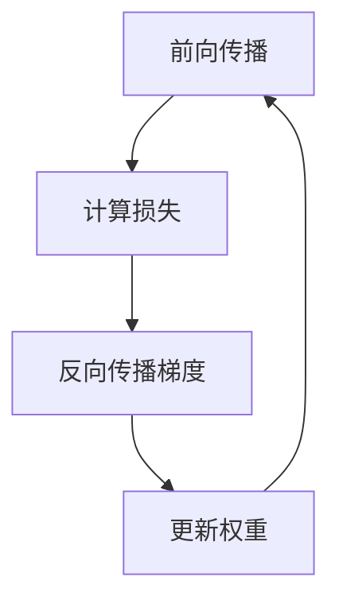

# 神经网络基础原理：从感知机到深度网络

神经网络是深度学习的核心基础，理解其原理对于掌握现代AI技术至关重要。本文将从最基础的感知机出发，逐步深入到多层神经网络，帮助你建立完整的知识体系。

## 一、神经网络发展历程

### 1.1 从生物学到数学模型

神经网络的思想源于对人脑神经元工作机制的模拟：


关键里程碑：
- **1958年**：Rosenblatt 提出感知机（Perceptron）
- **1986年**：Rumelhart 等提出反向传播算法
- **1998年**：LeCun 提出 LeNet-5（卷积神经网络）
- **2012年**：AlexNet 在 ImageNet 夺冠，开启深度学习时代
- **2017年**：Transformer 架构诞生，引领NLP革命

### 1.2 生物神经元与数学模型对比

| 生物神经元 | 数学模型 |
|-----------|---------|
| 树突接收信号 | 输入特征 x |
| 细胞体处理信息 | 加权求和 ∑wx |
| 轴突传递信号 | 输出结果 y |
| 神经递质控制强度 | 权重参数 w |

## 二、感知机：最基础的神经网络

### 2.1 感知机模型

感知机是单层神经网络，只能处理线性可分问题：

**数学表达**：
```
y = sign(w·x + b)
其中：
- x: 输入特征向量
- w: 权重向量
- b: 偏置项
- sign: 激活函数（输出 +1 或 -1）
```

**Python实现**：

```python
import numpy as np

class Perceptron:
    def __init__(self, learning_rate=0.01, n_epochs=100):
        self.lr = learning_rate
        self.n_epochs = n_epochs
        
    def fit(self, X, y):
        # 初始化权重和偏置
        n_features = X.shape[1]
        self.w = np.zeros(n_features)
        self.b = 0
        
        # 训练过程
        for epoch in range(self.n_epochs):
            for xi, target in zip(X, y):
                # 计算预测值
                prediction = self.predict_one(xi)
                # 更新权重（感知机学习规则）
                if prediction != target:
                    self.w += self.lr * target * xi
                    self.b += self.lr * target
        
    def predict_one(self, x):
        return np.sign(np.dot(self.w, x) + self.b)
    
    def predict(self, X):
        return np.array([self.predict_one(xi) for xi in X])

# 示例：训练感知机
X = np.array([[1, 1], [1, -1], [-1, 1], [-1, -1]])
y = np.array([1, -1, -1, -1])  # XOR问题的简化版

perceptron = Perceptron(learning_rate=0.1, n_epochs=1000)
perceptron.fit(X, y)
print("训练后权重:", perceptron.w)
print("训练后偏置:", perceptron.b)
```

### 2.2 感知机的局限性

感知机无法处理非线性可分问题（如XOR问题）：

```python
# XOR问题：感知机无法解决
X_xor = np.array([[0, 0], [0, 1], [1, 0], [1, 1]])
y_xor = np.array([0, 1, 1, 0])

perceptron_xor = Perceptron(learning_rate=0.1, n_epochs=1000)
perceptron_xor.fit(X_xor, y_xor)
predictions = perceptron_xor.predict(X_xor)
print("XOR预测结果:", predictions)  # 无法正确分类
```

这促使多层神经网络的发展。

## 三、多层神经网络（MLP）

### 3.1 多层感知机架构

多层感知机通过增加隐藏层解决非线性问题：

**网络结构**：
```
输入层 → 隐藏层(s) → 输出层
```

每层的计算过程：
```
h = activation(W·x + b)  # 隐藏层
y = W_out·h + b_out      # 输出层
```

### 3.2 激活函数

激活函数为神经网络引入非线性，常见类型：

| 激活函数 | 公式 | 特点 | 适用场景 |
|---------|------|------|---------|
| Sigmoid | σ(x) = 1/(1+e⁻ˣ) | 输出[0,1]，平滑 | 二分类输出层 |
| Tanh | tanh(x) = (eˣ-e⁻ˣ)/(eˣ+e⁻ˣ) | 输出[-1,1]，零中心 | 隐藏层（旧） |
| ReLU | max(0, x) | 计算快，无梯度消失 | 隐藏层（主流） |
| Leaky ReLU | max(0.01x, x) | 解决ReLU死神经元 | 深层网络 |
| Softmax | eˣᵢ/∑eˣⱼ | 输出概率分布 | 多分类输出层 |

**可视化激活函数**：

```python
import matplotlib.pyplot as plt

def sigmoid(x):
    return 1 / (1 + np.exp(-x))

def relu(x):
    return np.maximum(0, x)

def leaky_relu(x, alpha=0.01):
    return np.where(x > 0, x, alpha * x)

x = np.linspace(-5, 5, 100)

plt.figure(figsize=(12, 4))
plt.subplot(131)
plt.plot(x, sigmoid(x))
plt.title('Sigmoid')
plt.grid(True)

plt.subplot(132)
plt.plot(x, relu(x))
plt.title('ReLU')
plt.grid(True)

plt.subplot(133)
plt.plot(x, leaky_relu(x))
plt.title('Leaky ReLU')
plt.grid(True)

plt.tight_layout()
plt.show()
```

### 3.3 PyTorch 实现多层神经网络

```python
import torch
import torch.nn as nn
import torch.optim as optim

# 定义 MLP 模型
class MLP(nn.Module):
    def __init__(self, input_size, hidden_size, output_size):
        super(MLP, self).__init__()
        self.layer1 = nn.Linear(input_size, hidden_size)
        self.activation = nn.ReLU()
        self.layer2 = nn.Linear(hidden_size, output_size)
        
    def forward(self, x):
        x = self.layer1(x)
        x = self.activation(x)
        x = self.layer2(x)
        return x

# 实例化模型
model = MLP(input_size=10, hidden_size=20, output_size=2)
print("模型结构:")
print(model)

# 生成训练数据
X_train = torch.randn(1000, 10)
y_train = torch.randint(0, 2, (1000,))

# 定义损失函数和优化器
criterion = nn.CrossEntropyLoss()
optimizer = optim.Adam(model.parameters(), lr=0.01)

# 训练循环
for epoch in range(50):
    # 前向传播
    outputs = model(X_train)
    loss = criterion(outputs, y_train)
    
    # 反向传播
    optimizer.zero_grad()
    loss.backward()
    optimizer.step()
    
    if (epoch + 1) % 10 == 0:
        print(f'Epoch [{epoch+1}/50], Loss: {loss.item():.4f}')
```

## 四、反向传播算法

### 4.1 核心思想

反向传播通过链式法则计算梯度，逐层更新权重：



**链式法则**：
```
∂L/∂w = ∂L/∂y · ∂y/∂h · ∂h/∂w
```

### 4.2 计算图示例

```python
# 手动实现反向传播理解过程
x = torch.tensor([2.0], requires_grad=True)
w = torch.tensor([3.0], requires_grad=True)
b = torch.tensor([1.0], requires_grad=True)

# 前向传播
h = w * x + b  # 隐藏层
y = torch.sigmoid(h)  # 输出

# 计算损失（假设目标值为0.5）
target = torch.tensor([0.5])
loss = (y - target)**2

# 反向传播
loss.backward()

print(f"损失值: {loss.item():.4f}")
print(f"权重梯度: {w.grad.item():.4f}")
print(f"输入梯度: {x.grad.item():.4f}")
```

### 4.3 优化算法

不同优化算法影响训练效率和收敛速度：

| 优化器 | 特点 | 适用场景 |
|--------|------|---------|
| SGD | 简单可靠，收敛慢 | 简单任务 |
| Momentum | 加速收敛，减少震荡 | 中等复杂度 |
| Adam | 自适应学习率，收敛快 | 复杂任务（主流） |
| RMSprop | 自适应学习率 | RNN类网络 |

```python
# 比较不同优化器
optimizers = {
    'SGD': optim.SGD(model.parameters(), lr=0.01),
    'Momentum': optim.SGD(model.parameters(), lr=0.01, momentum=0.9),
    'Adam': optim.Adam(model.parameters(), lr=0.01)
}

loss_history = {}
for name, optimizer in optimizers.items():
    model_copy = MLP(10, 20, 2)
    losses = []
    for epoch in range(20):
        outputs = model_copy(X_train)
        loss = criterion(outputs, y_train)
        optimizer.zero_grad()
        loss.backward()
        optimizer.step()
        losses.append(loss.item())
    loss_history[name] = losses

# 可视化损失曲线
plt.figure(figsize=(10, 6))
for name, losses in loss_history.items():
    plt.plot(losses, label=name)
plt.xlabel('Epoch')
plt.ylabel('Loss')
plt.title('优化器对比')
plt.legend()
plt.grid(True)
plt.show()
```

## 五、深度神经网络实践

### 5.1 深层网络设计原则

设计深度神经网络需考虑：

1. **层数选择**：
   - 简单任务：2-3层足够
   - 复杂任务（图像、NLP）：数十层甚至上百层

2. **隐藏层大小**：
   - 从小到大逐步尝试
   - 避免过大导致过拟合

3. **激活函数选择**：
   - 隐藏层：ReLU及其变体
   - 输出层：根据任务选择

```python
# 深层 MLP 示例
class DeepMLP(nn.Module):
    def __init__(self, input_size, hidden_sizes, output_size):
        super(DeepMLP, self).__init__()
        layers = []
        
        # 构建多层结构
        prev_size = input_size
        for hidden_size in hidden_sizes:
            layers.append(nn.Linear(prev_size, hidden_size))
            layers.append(nn.ReLU())
            layers.append(nn.BatchNorm1d(hidden_size))  # 加速训练
            prev_size = hidden_size
        
        layers.append(nn.Linear(prev_size, output_size))
        self.network = nn.Sequential(*layers)
    
    def forward(self, x):
        return self.network(x)

# 实例化深层网络
deep_model = DeepMLP(
    input_size=10,
    hidden_sizes=[64, 128, 64],
    output_size=2
)
print(deep_model)
```

### 5.2 防止过拟合技术

深度网络容易过拟合，常用解决方法：

**Dropout**：
```python
class MLPWithDropout(nn.Module):
    def __init__(self, input_size, hidden_size, output_size, dropout_rate=0.3):
        super(MLPWithDropout, self).__init__()
        self.layer1 = nn.Linear(input_size, hidden_size)
        self.dropout = nn.Dropout(dropout_rate)
        self.layer2 = nn.Linear(hidden_size, output_size)
        
    def forward(self, x):
        x = self.layer1(x)
        x = self.dropout(x)  # 训练时随机丢弃神经元
        x = self.layer2(x)
        return x
```

**Batch Normalization**：
```python
class MLPWithBN(nn.Module):
    def __init__(self, input_size, hidden_size, output_size):
        super(MLPWithBN, self).__init__()
        self.layer1 = nn.Linear(input_size, hidden_size)
        self.bn1 = nn.BatchNorm1d(hidden_size)  # 标准化中间输出
        self.activation = nn.ReLU()
        self.layer2 = nn.Linear(hidden_size, output_size)
        
    def forward(self, x):
        x = self.layer1(x)
        x = self.bn1(x)
        x = self.activation(x)
        x = self.layer2(x)
        return x
```

### 5.3 TensorFlow/Keras 实现

```python
import tensorflow as tf
from tensorflow import keras

# 使用 Keras 快速构建网络
model_keras = keras.Sequential([
    keras.layers.Dense(64, activation='relu', input_shape=(10,)),
    keras.layers.Dropout(0.3),
    keras.layers.Dense(128, activation='relu'),
    keras.layers.BatchNormalization(),
    keras.layers.Dense(64, activation='relu'),
    keras.layers.Dense(2, activation='softmax')
])

model_keras.compile(
    optimizer='adam',
    loss='sparse_categorical_crossentropy',
    metrics=['accuracy']
)

model_keras.summary()

# 训练
history = model_keras.fit(
    X_train.numpy(), y_train.numpy(),
    epochs=50,
    batch_size=32,
    validation_split=0.2,
    verbose=1
)

# 可视化训练过程
plt.figure(figsize=(12, 4))
plt.subplot(121)
plt.plot(history.history['loss'], label='Train Loss')
plt.plot(history.history['val_loss'], label='Val Loss')
plt.title('Loss Curve')
plt.legend()

plt.subplot(122)
plt.plot(history.history['accuracy'], label='Train Acc')
plt.plot(history.history['val_accuracy'], label='Val Acc')
plt.title('Accuracy Curve')
plt.legend()

plt.tight_layout()
plt.show()
```

## 六、总结与实践建议

### 6.1 关键要点总结

1. **神经网络本质**：通过多层非线性变换学习复杂映射关系
2. **激活函数**：引入非线性，ReLU是现代主流选择
3. **反向传播**：基于链式法则的高效梯度计算
4. **优化算法**：Adam是目前最实用的选择
5. **正则化技术**：Dropout、BatchNorm防止过拟合

### 6.2 学习路径建议


### 6.3 实践资源

- **框架选择**：
  - PyTorch：动态图，灵活性强，适合研究
  - TensorFlow/Keras：静态图，生产部署友好
  
- **学习资源**：
  - PyTorch官方教程
  - Stanford CS231n课程
  - Deep Learning Book

---

**下一步学习**：
- [卷积神经网络原理](/ai/deep-learning/cnn-fundamentals)
- [循环神经网络详解](/ai/deep-learning/rnn-details)
- [Transformer架构分析](/ai/nlp/transformer-architecture)