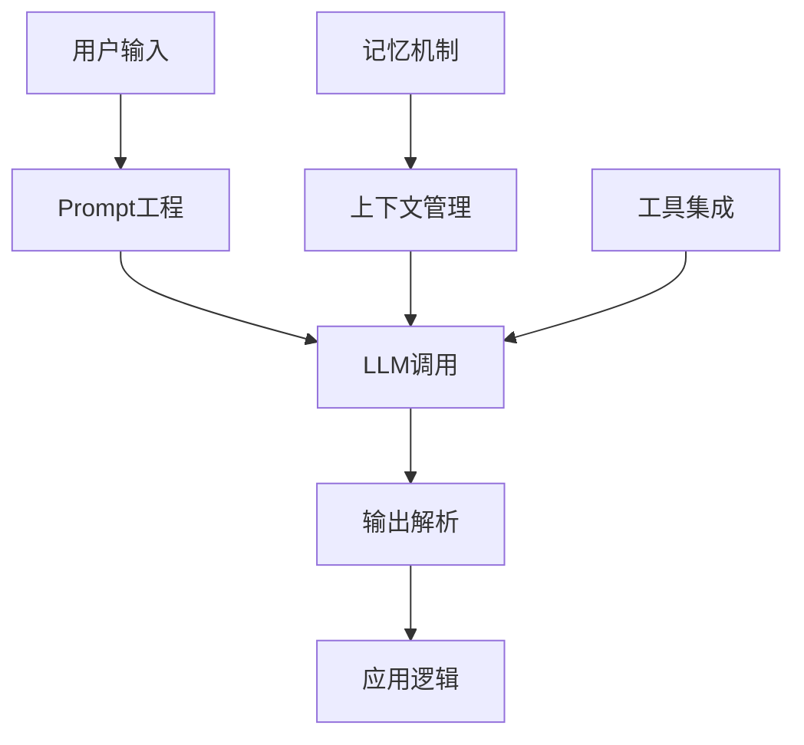
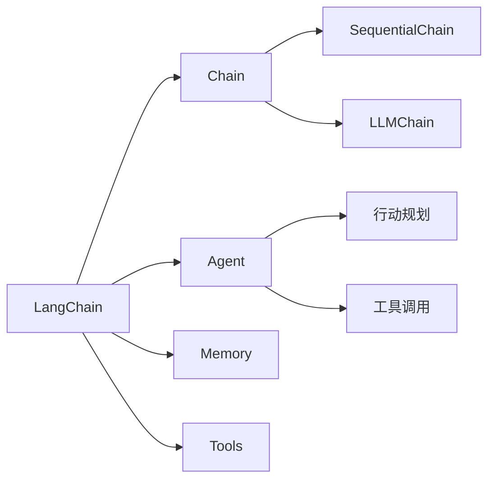

# LLM应用开发指南：从调用到定制

大语言模型（LLM）正在重塑AI应用开发范式。本文将系统讲解LLM应用开发的全流程技术栈，帮助你从零构建实用的LLM应用。

## 一、LLM技术全景

### 1.1 主流LLM对比

| 模型 | 开发者 | 特点 | 适用场景 |
|------|--------|------|---------|
| GPT-4 | OpenAI | 综合能力强 | 通用对话、复杂任务 |
| Claude | Anthropic | 安全性好、长文本 | 专业领域、文档分析 |
| LLaMA | Meta | 开源可定制 | 研究、定制应用 |
| ChatGLM | 清华 | 中文友好 | 中文应用 |
| Gemini | Google | 多模态 | 图文理解 |

### 1.2 应用架构



## 二、LLM API调用

### 2.1 OpenAI API

```python
import openai
from openai import OpenAI

client = OpenAI(api_key="your-api-key")

# 基础对话
response = client.chat.completions.create(
    model="gpt-4",
    messages=[
        {"role": "system", "content": "你是一个专业的技术助手"},
        {"role": "user", "content": "解释什么是神经网络"}
    ],
    temperature=0.7,
    max_tokens=500
)

print("模型回复:", response.choices[0].message.content)
```

### 2.2 参数调优

关键参数解析：

```python
# 完整参数示例
response = client.chat.completions.create(
    model="gpt-4",
    messages=[
        {"role": "user", "content": "写一篇技术文章"}
    ],
    
    # 温度参数（0-2）
    temperature=0.8,  # 高温度：创意性强，低温度：确定性高
    
    # 最大输出长度
    max_tokens=1000,
    
    # 停止词
    stop=["结束", "---"],
    
    # Top-p采样
    top_p=0.9,
    
    # 频率惩罚（减少重复）
    frequency_penalty=0.5,
    
    # 存在惩罚（鼓励多样性）
    presence_penalty=0.3
)

print("参数说明:")
print("  temperature: 控制随机性，创意任务建议0.7-0.9")
print("  max_tokens: 控制输出长度，注意计费")
print("  top_p: 核采样，影响输出质量")
```

### 2.3 流式输出

```python
# 流式响应（实时显示）
stream = client.chat.completions.create(
    model="gpt-4",
    messages=[{"role": "user", "content": "写一首诗"}],
    stream=True
)

print("流式输出:")
for chunk in stream:
    if chunk.choices[0].delta.content:
        print(chunk.choices[0].delta.content, end="", flush=True)

print("\n")
```

### 2.4 其他LLM API

**Claude API**：
```python
import anthropic

client = anthropic.Anthropic(api_key="your-api-key")

message = client.messages.create(
    model="claude-3-opus-20240229",
    max_tokens=1024,
    messages=[
        {"role": "user", "content": "解释深度学习"}
    ]
)

print("Claude回复:", message.content[0].text)
```

**开源模型（Ollama本地部署）**：
```python
import requests

# 调用本地Ollama
response = requests.post(
    "http://localhost:11434/api/generate",
    json={
        "model": "llama2",
        "prompt": "解释什么是机器学习"
    }
)

print("本地LLaMA回复:", response.json()["response"])
```

## 三、Prompt工程

### 3.1 Prompt设计原则

**结构化Prompt**：

```python
def structured_prompt(task, context, requirements):
    prompt = f"""
任务: {task}

背景信息:
{context}

要求:
{requirements}

输出格式:
请按照以下结构组织输出：
1. 核心观点
2. 详细解释
3. 实例说明
"""
    return prompt

# 示例使用
prompt = structured_prompt(
    task="解释Transformer架构",
    context="面向有深度学习基础的工程师",
    requirements="通俗易懂，包含代码示例"
)

response = client.chat.completions.create(
    model="gpt-4",
    messages=[{"role": "user", "content": prompt}]
)

print("结构化Prompt输出:")
print(response.choices[0].message.content)
```

### 3.2 角色扮演

```python
def role_prompt(role, expertise, tone):
    return f"""你是一位{role}。
专业知识: {expertise}
语气风格: {tone}

请根据你的角色特点回答问题。"""

# 定义专家角色
expert_prompt = role_prompt(
    role="资深AI架构师",
    expertise="深度学习、分布式系统、工程实践",
    tone="专业、严谨、实用"
)

response = client.chat.completions.create(
    model="gpt-4",
    messages=[
        {"role": "system", "content": expert_prompt},
        {"role": "user", "content": "如何设计一个大规模推荐系统？"}
    ]
)

print("专家角色回答:")
print(response.choices[0].message.content)
```

### 3.3 Few-shot Learning

```python
def few_shot_prompt(examples, new_input):
    prompt = "以下是示例:\n\n"
    for example in examples:
        prompt += f"输入: {example['input']}\n"
        prompt += f"输出: {example['output']}\n\n"
    
    prompt += f"现在请处理:\n输入: {new_input}\n输出:"
    return prompt

# 示例数据
examples = [
    {"input": "苹果", "output": "水果，红色/绿色，富含维生素"},
    {"input": "汽车", "output": "交通工具，机械动力，载运乘客"},
    {"input": "电脑", "output": "电子设备，信息处理，办公学习"}
]

prompt = few_shot_prompt(examples, "手机")

response = client.chat.completions.create(
    model="gpt-4",
    messages=[{"role": "user", "content": prompt}]
)

print("Few-shot输出:")
print(response.choices[0].message.content)
```

### 3.4 Chain-of-Thought

```python
def cot_prompt(question):
    return f"""问题: {question}

请按照以下步骤思考:
1. 理解问题的核心
2. 分析相关知识点
3. 建立推理逻辑
4. 得出结论

请详细展示每一步的思考过程。"""

# 复杂推理任务
question = "如果一个神经网络有3层，每层分别有10、20、5个神经元，计算总参数量（假设全连接）"

prompt = cot_prompt(question)

response = client.chat.completions.create(
    model="gpt-4",
    messages=[{"role": "user", "content": prompt}],
    temperature=0.3  # 低温度确保推理准确性
)

print("Chain-of-Thought推理:")
print(response.choices[0].message.content)
```

## 四、LangChain框架

### 4.1 LangChain核心概念



### 4.2 基础Chain

```python
from langchain_openai import OpenAI
from langchain.prompts import PromptTemplate
from langchain.chains import LLMChain

# 初始化LLM
llm = OpenAI(api_key="your-api-key", temperature=0.7)

# 定义Prompt模板
template = """你是一个{role}。

任务: {task}

请提供专业解答。"""

prompt = PromptTemplate(
    input_variables=["role", "task"],
    template=template
)

# 创建Chain
chain = LLMChain(llm=llm, prompt=prompt)

# 执行
result = chain.run(role="技术专家", task="解释微服务架构")
print("LangChain输出:")
print(result)
```

### 4.3 Sequential Chain

```python
from langchain.chains import SequentialChain

# 多步骤Chain
template1 = "生成一个关于{topic}的标题"
prompt1 = PromptTemplate(input_variables=["topic"], template=template1)
chain1 = LLMChain(llm=llm, prompt=prompt1, output_key="title")

template2 = "根据标题'{title}'写一篇简短摘要"
prompt2 = PromptTemplate(input_variables=["title"], template=template2)
chain2 = LLMChain(llm=llm, prompt=prompt2, output_key="summary")

# 组合Chain
overall_chain = SequentialChain(
    chains=[chain1, chain2],
    input_variables=["topic"],
    output_variables=["title", "summary"]
)

result = overall_chain({"topic": "人工智能"})
print("标题:", result["title"])
print("摘要:", result["summary"])
```

### 4.4 Agent与工具

```python
from langchain.agents import initialize_agent, Tool
from langchain.tools import DuckDuckGoSearchRun

# 定义工具
search = DuckDuckGoSearchRun()

tools = [
    Tool(
        name="Search",
        func=search.run,
        description="搜索最新信息"
    )
]

# 创建Agent
agent = initialize_agent(
    tools,
    llm,
    agent="zero-shot-react-description",
    verbose=True
)

# 执行任务
result = agent.run("查找2025年最新AI技术趋势")
print("Agent执行结果:")
print(result)
```

### 4.5 Memory机制

```python
from langchain.memory import ConversationBufferMemory

# 添加记忆
memory = ConversationBufferMemory()

chain_with_memory = LLMChain(
    llm=llm,
    prompt=prompt,
    memory=memory
)

# 多轮对话
print("第一轮:")
response1 = chain_with_memory.run(role="助手", task="你好")
print(response1)

print("\n第二轮（带记忆）:")
response2 = chain_with_memory.run(role="助手", task="我刚才说了什么")
print(response2)
```

## 五、上下文管理

### 5.1 Token计数

```python
import tiktoken

def count_tokens(text, model="gpt-4"):
    encoding = tiktoken.encoding_for_model(model)
    return len(encoding.encode(text))

# 示例
text = "这是一段示例文本，用于计算Token数量"
token_count = count_tokens(text)
print(f"Token数量: {token_count}")

# 管理长文本
def truncate_text(text, max_tokens=4000, model="gpt-4"):
    encoding = tiktoken.encoding_for_model(model)
    tokens = encoding.encode(text)
    if len(tokens) > max_tokens:
        tokens = tokens[:max_tokens]
        text = encoding.decode(tokens)
    return text
```

### 5.2 文本分块

```python
def chunk_text(text, chunk_size=500):
    """将长文本分块处理"""
    chunks = []
    for i in range(0, len(text), chunk_size):
        chunks.append(text[i:i+chunk_size])
    return chunks

# 处理长文档
long_doc = "..."  # 长文档内容
chunks = chunk_text(long_doc)

# 逐块处理
results = []
for chunk in chunks[:5]:  # 示例处理前5块
    response = client.chat.completions.create(
        model="gpt-4",
        messages=[{"role": "user", "content": f"总结这段内容:\n{chunk}"}]
    )
    results.append(response.choices[0].message.content)

print(f"处理了 {len(results)} 个文本块")
```

### 5.3 向量存储与检索

```python
from langchain.vectorstores import Chroma
from langchain.embeddings import OpenAIEmbeddings
from langchain.text_splitter import RecursiveCharacterTextSplitter

# 文本分割
text_splitter = RecursiveCharacterTextSplitter(
    chunk_size=1000,
    chunk_overlap=200
)

texts = text_splitter.split_text(long_doc)

# 向量化存储
embeddings = OpenAIEmbeddings(api_key="your-api-key")
vectorstore = Chroma.from_texts(texts, embeddings)

# 检索
query = "什么是深度学习"
docs = vectorstore.similarity_search(query, k=3)

print("检索结果:")
for i, doc in enumerate(docs):
    print(f"\n文档{i+1}: {doc[:200]}...")
```

## 六、模型微调

### 6.1 微调场景判断

| 场景 | 是否微调 | 替代方案 |
|------|---------|---------|
| 通用对话 | 否 | Prompt工程 |
| 特定领域知识 | 是 | RAG + Prompt |
| 特殊输出格式 | 是 | Few-shot + Prompt |
| 私有数据 | 是 | 微调或RAG |

### 6.2 OpenAI微调

```python
# 准备训练数据（JSONL格式）
training_data = [
    {"prompt": "问题1", "completion": "期望回答1"},
    {"prompt": "问题2", "completion": "期望回答2"}
]

# 上传数据文件
file = client.files.create(
    file=open("training_data.jsonl", "rb"),
    purpose="fine-tune"
)

# 创建微调任务
fine_tune = client.fine_tuning.jobs.create(
    training_file=file.id,
    model="gpt-3.5-turbo"
)

print(f"微调任务ID: {fine_tune.id}")
print(f"状态: {fine_tune.status}")
```

### 6.3 本地模型微调

```python
# 使用开源模型微调（示意）
from transformers import AutoModelForCausalLM, AutoTokenizer, Trainer

# 加载基础模型
model = AutoModelForCausalLM.from_pretrained("llama-7b")
tokenizer = AutoTokenizer.from_pretrained("llama-7b")

# 准备数据
def prepare_data(texts):
    return tokenizer(texts, truncation=True, padding=True, return_tensors="pt")

# 微调训练（简化示例）
# 实际需完整训练脚本、数据集、超参数等
print("本地模型微调配置就绪")
```

## 七、应用实践案例

### 7.1 智能问答系统

```python
class QASystem:
    def __init__(self, api_key):
        self.client = OpenAI(api_key=api_key)
        self.memory = []
    
    def ask(self, question):
        # 构建上下文
        messages = self.memory + [
            {"role": "user", "content": question}
        ]
        
        # 调用模型
        response = self.client.chat.completions.create(
            model="gpt-4",
            messages=messages
        )
        
        # 更新记忆
        answer = response.choices[0].message.content
        self.memory.append({"role": "user", "content": question})
        self.memory.append({"role": "assistant", "content": answer})
        
        return answer

# 使用示例
qa = QASystem("your-api-key")
print("问答:", qa.ask("什么是机器学习"))
print("追问:", qa.ask("它有哪些应用"))
```

### 7.2 文档摘要生成

```python
def summarize_document(doc_text):
    prompt = f"""请总结以下文档的核心内容：

{doc_text}

要求：
1. 提取关键观点
2. 保留重要细节
3. 控制在300字以内
"""
    
    response = client.chat.completions.create(
        model="gpt-4",
        messages=[{"role": "user", "content": prompt}],
        temperature=0.3
    )
    
    return response.choices[0].message.content

# 示例
doc = "机器学习是人工智能的核心技术..."
summary = summarize_document(doc)
print("文档摘要:", summary)
```

### 7.3 代码生成助手

```python
def code_generator(task, language="Python"):
    prompt = f"""生成{language}代码完成以下任务：

任务: {task}

要求:
1. 代码清晰规范
2. 包必要注释
3. 提供使用示例
"""
    
    response = client.chat.completions.create(
        model="gpt-4",
        messages=[{"role": "user", "content": prompt}],
        temperature=0.2
    )
    
    return response.choices[0].message.content

# 示例
code = code_generator("实现一个简单的HTTP服务器", "Python")
print("生成的代码:")
print(code)
```

## 八、总结与实践建议

### 8.1 技术选型指南

| 应用需求 | 推荐方案 |
|---------|---------|
| 快速原型 | Prompt工程 + API |
| 复杂流程 | LangChain + Agent |
| 知识密集 | RAG + 向量库 |
| 高定制化 | 模型微调 |
| 私有部署 | 开源模型 + 本地 |

### 8.2 最佳实践

1. **Prompt迭代**：持续优化Prompt效果
2. **成本控制**：合理设置max_tokens，使用流式输出
3. **异常处理**：添加重试机制，处理API错误
4. **安全合规**：过滤敏感内容，保护用户隐私

### 8.3 成本估算

```python
def estimate_cost(input_tokens, output_tokens, model="gpt-4"):
    # GPT-4价格（示例）
    prices = {
        "gpt-4": {"input": 0.03, "output": 0.06},  # 每1k tokens
        "gpt-3.5-turbo": {"input": 0.0015, "output": 0.002}
    }
    
    price = prices[model]
    input_cost = (input_tokens / 1000) * price["input"]
    output_cost = (output_tokens / 1000) * price["output"]
    
    return input_cost + output_cost

cost = estimate_cost(500, 300, "gpt-4")
print(f"预估成本: $${cost:.4f}")
```

---

**下一步学习**：
- [LangChain高级应用](/ai/llm/langchain-advanced)
- [RAG系统构建](/ai/llm/rag-system)
- [模型微调实战](/ai/llm/fine-tuning)