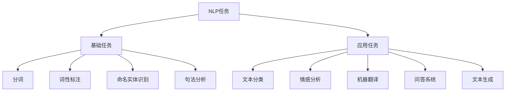

# NLP核心技术综述：从文本处理到语言理解

自然语言处理（NLP）是人工智能与语言学交叉领域，致力于让计算机理解、生成和处理人类语言。本文将系统梳理NLP的核心技术栈，帮助你建立完整的知识体系。

## 一、NLP技术全景

### 1.1 NLP任务分类



### 1.2 技术演进历程

| 时代 | 技术特征 | 代表模型 |
|------|---------|---------|
| 统计时代（2000前） | 规则+统计模型 | HMM、CRF |
| 深度学习时代（2013-2017） | 词向量+神经网络 | Word2Vec、RNN/LSTM |
| 预训练时代（2018-） | 大规模预训练 | BERT、GPT、Transformer |

## 二、文本预处理

### 2.1 分词技术

分词是NLP的基础步骤，直接影响后续任务效果。

**中文分词挑战**：
- 无明显分隔符
-歧义问题（"乒乓球拍卖完了"）
- 新词识别（网络用语、专业术语）

**主流分词工具**：

```python
import jieba
import jieba.posseg as pseg

# 精确模式分词
text = "自然语言处理是人工智能的重要分支"
words = jieba.lcut(text)
print("分词结果:", words)

# 添加自定义词典
jieba.add_word("自然语言处理")
words_custom = jieba.lcut(text)
print("自定义分词:", words_custom)

# 词性标注
words_pos = pseg.lcut(text)
for word, flag in words_pos:
    print(f"{word} ({flag})")
```

**英文分词**：

```python
import nltk
from nltk.tokenize import word_tokenize, sent_tokenize

nltk.download('punkt')

text_en = "Natural language processing makes computers understand human language."

# 句子分割
sentences = sent_tokenize(text_en)
print("句子分割:", sentences)

# 词分割
words_en = word_tokenize(text_en)
print("单词分割:", words_en)
```

### 2.2 文本清洗

去除噪声数据，提升文本质量：

```python
import re

def clean_text(text):
    # 去除HTML标签
    text = re.sub(r'<[^>]+>', '', text)
    
    # 去除特殊字符
    text = re.sub(r'[^\w\s]', '', text)
    
    # 去除数字
    text = re.sub(r'\d+', '', text)
    
    # 去除多余空格
    text = re.sub(r'\s+', ' ', text).strip()
    
    return text

raw_text = "这是一个<div>示例</div>文本，包含123数字！"
cleaned = clean_text(raw_text)
print("清洗后:", cleaned)
```

### 2.3 去停用词

停用词对语义贡献小，需要过滤：

```python
from nltk.corpus import stopwords
nltk.download('stopwords')

# 英文停用词
stop_words_en = set(stopwords.words('english'))
text_en_clean = [w for w in words_en if w.lower() not in stop_words_en]
print("去停用词后:", text_en_clean)

# 中文停用词（需自定义或使用第三方库）
stop_words_cn = ['的', '是', '在', '了', '和', '等']
words_cn_clean = [w for w in words if w not in stop_words_cn]
print("中文去停用词:", words_cn_clean)
```

## 三、词向量表示

### 3.1 传统表示方法

**One-Hot编码**：
```python
from sklearn.preprocessing import OneHotEncoder
import numpy as np

vocab = ['自然', '语言', '处理', '人工智能']
encoder = OneHotEncoder(sparse_output=False)
onehot = encoder.fit_transform(np.array(vocab).reshape(-1, 1))
print("One-Hot编码:")
for word, vec in zip(vocab, onehot):
    print(f"  {word}: {vec}")
```

**缺点**：
- 维度爆炸（词典大小决定维度）
- 无法表达语义相似性
- 稀疏性严重

### 3.2 Word2Vec

Word2Vec通过神经网络学习词的分布式表示：

**两种架构**：
- CBOW：根据上下文预测目标词
- Skip-gram：根据目标词预测上下文

```python
from gensim.models import Word2Vec

# 训练数据
sentences = [
    ['自然', '语言', '处理', '很', '有趣'],
    ['人工智能', '正在', '改变', '世界'],
    ['深度', '学习', '是', '人工智能', '的核心']
]

# 训练Word2Vec模型
model = Word2Vec(
    sentences,
    vector_size=100,  # 词向量维度
    window=5,         # 上下文窗口大小
    min_count=1,      # 最小词频
    workers=4         # 并行线程
)

# 获取词向量
vector = model.wv['人工智能']
print(f"'人工智能'向量维度: {vector.shape}")

# 计算词相似度
similarity = model.wv.similarity('人工智能', '深度')
print(f"相似度: {similarity:.4f}")

# 找相似词
similar_words = model.wv.most_similar('人工智能', topn=5)
print("相似词:", similar_words)
```

### 3.3 GloVe

GloVe结合全局统计信息与局部上下文：

```python
from gensim.models import KeyedVectors

# 加载预训练GloVe模型（需下载）
# glove_model = KeyedVectors.load_word2vec_format('glove.6B.100d.txt', binary=False)

# 示例：使用gensim加载
# similarity = glove_model.similarity('ai', 'machine-learning')
```

### 3.4 FastText

FastText将词拆分为子词（字符n-gram），更好处理罕见词：

```python
from gensim.models import FastText

fasttext_model = FastText(
    sentences,
    vector_size=100,
    window=5,
    min_count=1,
    workers=4
)

# 对未见过词也能生成向量
vector_unknown = fasttext_model.wv['新词汇']
print(f"未见词向量: {vector_unknown.shape}")
```

## 四、序列模型

### 4.1 RNN基础

循环神经网络（RNN）处理序列数据，保留历史信息：

```python
import torch
import torch.nn as nn

class SimpleRNN(nn.Module):
    def __init__(self, input_size, hidden_size, output_size):
        super(SimpleRNN, self).__init__()
        self.rnn = nn.RNN(input_size, hidden_size, batch_first=True)
        self.fc = nn.Linear(hidden_size, output_size)
        
    def forward(self, x):
        # RNN层
        out, hidden = self.rnn(x)
        # 取最后时刻输出
        out = self.fc(out[:, -1, :])
        return out

# 示例
rnn_model = SimpleRNN(input_size=10, hidden_size=20, output_size=2)
print("RNN模型:")
print(rnn_model)
```

### 4.2 LSTM

LSTM解决RNN的梯度消失问题，引入门控机制：

**核心结构**：
- 遗忘门：决定丢弃哪些历史信息
- 输入门：决定接收哪些新信息
- 输出门：决定输出哪些信息

```python
class LSTMModel(nn.Module):
    def __init__(self, input_size, hidden_size, output_size, num_layers=2):
        super(LSTMModel, self).__init__()
        self.lstm = nn.LSTM(
            input_size,
            hidden_size,
            num_layers=num_layers,
            batch_first=True,
            dropout=0.3
        )
        self.fc = nn.Linear(hidden_size, output_size)
        
    def forward(self, x):
        out, (hidden, cell) = self.lstm(x)
        out = self.fc(out[:, -1, :])
        return out

lstm_model = LSTMModel(10, 20, 2)
print("\nLSTM模型:")
print(lstm_model)
```

### 4.3 GRU

GRU简化LSTM，减少计算量：

```python
class GRUModel(nn.Module):
    def __init__(self, input_size, hidden_size, output_size):
        super(GRUModel, self).__init__()
        self.gru = nn.GRU(input_size, hidden_size, batch_first=True)
        self.fc = nn.Linear(hidden_size, output_size)
        
    def forward(self, x):
        out, hidden = self.gru(x)
        out = self.fc(out[:, -1, :])
        return out
```

### 4.4 双向RNN

双向RNN同时利用前后文信息：

```python
class BiLSTM(nn.Module):
    def __init__(self, input_size, hidden_size, output_size):
        super(BiLSTM, self).__init__()
        self.lstm = nn.LSTM(
            input_size,
            hidden_size,
            bidirectional=True,  # 双向
            batch_first=True
        )
        self.fc = nn.Linear(hidden_size * 2, output_size)  # 注意维度翻倍
        
    def forward(self, x):
        out, _ = self.lstm(x)
        out = self.fc(out[:, -1, :])
        return out
```

## 五、Transformer架构

### 5.1 核心创新

Transformer用注意力机制替代循环结构：

**关键组件**：
1. **自注意力机制**：序列内部元素间关联建模
2. **位置编码**：注入位置信息
3. **多头注意力**：多角度捕捉依赖关系

### 5.2 自注意力机制

**计算过程**：
```
Attention(Q, K, V) = softmax(QK^T / √d_k) V
```

```python
import torch.nn.functional as F

class SelfAttention(nn.Module):
    def __init__(self, embed_size, heads):
        super(SelfAttention, self).__init__()
        self.embed_size = embed_size
        self.heads = heads
        
        self.query = nn.Linear(embed_size, embed_size)
        self.key = nn.Linear(embed_size, embed_size)
        self.value = nn.Linear(embed_size, embed_size)
        
    def forward(self, x):
        Q = self.query(x)
        K = self.key(x)
        V = self.value(x)
        
        # 计算注意力分数
        attention = F.softmax(torch.matmul(Q, K.transpose(-2, -1)) / 
                             torch.sqrt(torch.tensor(self.embed_size)), dim=-1)
        
        # 应用注意力
        out = torch.matmul(attention, V)
        return out

attention_layer = SelfAttention(embed_size=512, heads=8)
print("自注意力层:")
print(attention_layer)
```

### 5.3 Transformer完整实现

```python
class TransformerBlock(nn.Module):
    def __init__(self, embed_size, heads, dropout, forward_expansion):
        super(TransformerBlock, self).__init__()
        
        self.attention = SelfAttention(embed_size, heads)
        self.norm1 = nn.LayerNorm(embed_size)
        self.norm2 = nn.LayerNorm(embed_size)
        
        self.feed_forward = nn.Sequential(
            nn.Linear(embed_size, forward_expansion * embed_size),
            nn.ReLU(),
            nn.Linear(forward_expansion * embed_size, embed_size)
        )
        
        self.dropout = nn.Dropout(dropout)
        
    def forward(self, x):
        attention = self.attention(x)
        x = self.dropout(self.norm1(attention + x))  # Add & Norm
        forward = self.feed_forward(x)
        out = self.dropout(self.norm2(forward + x))  # Add & Norm
        return out

transformer_block = TransformerBlock(512, 8, 0.1, 4)
print("\nTransformer块:")
print(transformer_block)
```

### 5.4 位置编码

```python
class PositionalEncoding(nn.Module):
    def __init__(self, embed_size, max_length=5000):
        super(PositionalEncoding, self).__init__()
        
        pe = torch.zeros(max_length, embed_size)
        position = torch.arange(0, max_length, dtype=torch.float).unsqueeze(1)
        div_term = torch.exp(torch.arange(0, embed_size, 2).float() * 
                             (-torch.log(torch.tensor(10000.0)) / embed_size))
        
        pe[:, 0::2] = torch.sin(position * div_term)
        pe[:, 1::2] = torch.cos(position * div_term)
        
        self.register_buffer('pe', pe)
        
    def forward(self, x):
        return x + self.pe[:x.size(1), :]
```

## 六、预训练模型

### 6.1 BERT

BERT通过双向编码器预训练，擅长理解任务：

```python
from transformers import BertTokenizer, BertModel

# 加载预训练BERT
tokenizer = BertTokenizer.from_pretrained('bert-base-chinese')
model = BertModel.from_pretrained('bert-base-chinese')

# 文本编码
text = "自然语言处理很有趣"
inputs = tokenizer(text, return_tensors='pt')

# 获取BERT表示
outputs = model(**inputs)
last_hidden_states = outputs.last_hidden_state

print(f"输入文本: {text}")
print(f"BERT输出维度: {last_hidden_states.shape}")
```

### 6.2 GPT

GPT通过单向解码器预训练，擅长生成任务：

```python
from transformers import GPT2Tokenizer, GPT2LMHeadModel

# 加载预训练GPT-2
tokenizer_gpt = GPT2Tokenizer.from_pretrained('gpt2')
model_gpt = GPT2LMHeadModel.from_pretrained('gpt2')

# 文本生成
input_text = "Natural language processing is"
input_ids = tokenizer_gpt.encode(input_text, return_tensors='pt')

outputs_gpt = model_gpt.generate(
    input_ids,
    max_length=50,
    num_return_sequences=1,
    temperature=0.7
)

generated_text = tokenizer_gpt.decode(outputs_gpt[0], skip_special_tokens=True)
print(f"生成文本: {generated_text}")
```

### 6.3 应用示例：文本分类

```python
from transformers import BertForSequenceClassification, Trainer, TrainingArguments

# 构建分类模型
classifier = BertForSequenceClassification.from_pretrained(
    'bert-base-chinese',
    num_labels=2
)

# 示例数据
texts = ["这篇文章很好", "内容质量很差"]
labels = [1, 0]

# 编码
encodings = tokenizer(texts, truncation=True, padding=True, return_tensors='pt')

print("BERT文本分类模型就绪")
```

## 七、总结与实践建议

### 7.1 技术选型指南

| 任务类型 | 推荐技术 | 理由 |
|---------|---------|------|
| 简单分类 | TF-IDF + 机器学习 | 快速高效，资源占用少 |
| 语义理解 | BERT类模型 | 预训练优势，效果好 |
| 文本生成 | GPT类模型 | 生成能力强 |
| 序列标注 | BiLSTM-CRF | 结合序列建模与结构化输出 |

### 7.2 学习路径


### 7.3 实践资源

- **框架**：Hugging Face Transformers、spaCy、NLTK
- **数据集**：GLUE、SuperGLUE、CLUE（中文）
- **教程**：Hugging Face Course、CS224N

---

**下一步学习**：
- [Transformer架构深度解析](/ai/nlp/transformer-architecture)
- [情感分析实战](/ai/nlp/sentiment-analysis)
- [命名实体识别实践](/ai/nlp/ner-practice)