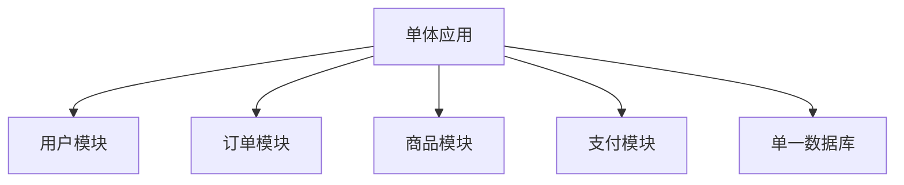
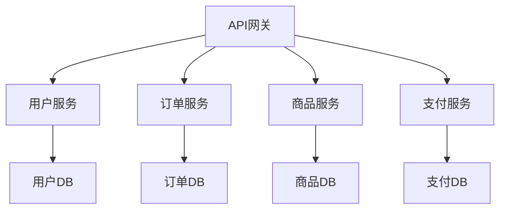
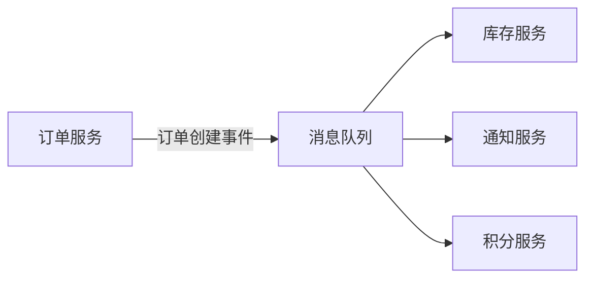

# 微服务架构设计：从理论到落地

微服务架构已成为构建大规模分布式系统的主流选择。本文将从架构原理出发，系统讲解微服务的设计、实现与运维实践。

## 一、微服务架构概述

### 1.1 单体架构 vs 微服务架构

**单体架构特点**：



| 维度 | 单体架构 | 微服务架构 |
|------|---------|-----------|
| 开发效率 | 初期快，后期慢 | 初期慢，后期快 |
| 部署 | 整体部署 | 独立部署 |
| 扩展性 | 整体扩展 | 按需扩展 |
| 技术栈 | 统一 | 可多样化 |
| 复杂度 | 简单 | 复杂 |
| 故障影响 | 全局 | 局部 |

**微服务架构特点**：



### 1.2 微服务核心原则

1. **单一职责**：每个服务只做一件事
2. **自治性**：服务独立开发、部署、运行
3. **去中心化**：数据去中心化、治理去中心化
4. **故障隔离**：单个服务故障不影响全局
5. **技术多样性**：不同服务可用不同技术栈

### 1.3 服务拆分策略

**按业务能力拆分**：

```
用户服务：用户注册、认证、权限管理
订单服务：订单创建、查询、状态管理
商品服务：商品管理、库存管理
支付服务：支付、退款
通知服务：邮件、短信、推送
```

**按领域驱动设计（DDD）拆分**：

```java
// 识别限界上下文
用户上下文
订单上下文
商品上下文
支付上下文

// 每个上下文对应一个微服务
```

## 二、服务通信

### 2.1 同步通信

**RESTful API**：

```java
@RestController
@RequestMapping("/api/users")
public class UserController {
    
    @GetMapping("/{id}")
    public User getUser(@PathVariable Long id) {
        return userService.findById(id);
    }
    
    @PostMapping
    public User createUser(@RequestBody UserDTO userDTO) {
        return userService.create(userDTO);
    }
}
```

**Feign声明式调用**：

```java
@FeignClient(name = "user-service")
public interface UserClient {
    
    @GetMapping("/api/users/{id}")
    User getUser(@PathVariable("id") Long id);
    
    @PostMapping("/api/users")
    User createUser(@RequestBody UserDTO userDTO);
}

// 使用
@Service
public class OrderService {
    
    @Autowired
    private UserClient userClient;
    
    public Order createOrder(Long userId) {
        User user = userClient.getUser(userId);
        // 创建订单逻辑
    }
}
```

### 2.2 异步通信

**消息队列（RabbitMQ/Kafka）**：

```java
// 生产者
@Service
public class OrderProducer {
    
    @Autowired
    private RabbitTemplate rabbitTemplate;
    
    public void sendOrderMessage(Order order) {
        rabbitTemplate.convertAndSend(
            "order.exchange", 
            "order.created", 
            order
        );
    }
}

// 消费者
@Component
public class OrderConsumer {
    
    @RabbitListener(queues = "order.queue")
    public void handleOrderCreated(Order order) {
        // 处理订单创建事件
        System.out.println("收到订单: " + order.getId());
    }
}
```

**事件驱动架构**：



### 2.3 服务间数据一致性

**Saga模式**：

```java
// 订单创建Saga
public class CreateOrderSaga {
    
    public void execute(Order order) {
        try {
            // 1. 创建订单
            orderService.create(order);
            
            // 2. 扣减库存
            inventoryService.reduce(order.getProductId(), order.getQuantity());
            
            // 3. 扣减余额
            accountService.deduct(order.getUserId(), order.getAmount());
            
        } catch (Exception e) {
            // 补偿事务
            compensate(order);
        }
    }
    
    private void compensate(Order order) {
        // 回滚库存
        inventoryService.add(order.getProductId(), order.getQuantity());
        // 回滚余额
        accountService.refund(order.getUserId(), order.getAmount());
    }
}
```

## 三、服务注册与发现

### 3.1 Nacos注册中心

**服务注册**：

```yaml
spring:
  application:
    name: user-service
  cloud:
    nacos:
      discovery:
        server-addr: localhost:8848
        namespace: dev
```

**服务发现**：

```java
@Service
public class OrderService {
    
    @Autowired
    private DiscoveryClient discoveryClient;
    
    public List<ServiceInstance> getUserServiceInstances() {
        return discoveryClient.getInstances("user-service");
    }
}
```

### 3.2 负载均衡

**Ribbon配置**：

```java
@Configuration
public class RibbonConfig {
    
    @Bean
    public IRule ribbonRule() {
        return new RoundRobinRule();  // 轮询策略
        // return new RandomRule();   // 随机策略
    }
}
```

**自定义负载均衡**：

```java
@Service
public class CustomLoadBalancer {
    
    @Autowired
    private DiscoveryClient discoveryClient;
    
    public ServiceInstance choose(String serviceId) {
        List<ServiceInstance> instances = discoveryClient.getInstances(serviceId);
        
        if (instances.isEmpty()) {
            return null;
        }
        
        // 简单轮询
        int index = (int) (System.currentTimeMillis() % instances.size());
        return instances.get(index);
    }
}
```

## 四、API网关

### 4.1 Spring Cloud Gateway

**路由配置**：

```yaml
spring:
  cloud:
    gateway:
      routes:
        - id: user-service
          uri: lb://user-service
          predicates:
            - Path=/api/users/**
          filters:
            - StripPrefix=1
        
        - id: order-service
          uri: lb://order-service
          predicates:
            - Path=/api/orders/**
          filters:
            - StripPrefix=1
```

**过滤器**：

```java
@Component
public class AuthFilter implements GlobalFilter {
    
    @Override
    public Mono<Void> filter(ServerWebExchange exchange, GatewayFilterChain chain) {
        String token = exchange.getRequest().getHeaders().getFirst("Authorization");
        
        if (token == null || !validateToken(token)) {
            exchange.getResponse().setStatusCode(HttpStatus.UNAUTHORIZED);
            return exchange.getResponse().setComplete();
        }
        
        return chain.filter(exchange);
    }
    
    private boolean validateToken(String token) {
        // JWT验证逻辑
        return true;
    }
}
```

**限流配置**：

```yaml
spring:
  cloud:
    gateway:
      routes:
        - id: user-service
          uri: lb://user-service
          predicates:
            - Path=/api/users/**
          filters:
            - name: RequestRateLimiter
              args:
                redis-rate-limiter.replenishRate: 10
                redis-rate-limiter.burstCapacity: 20
```

## 五、配置中心

### 5.1 Nacos配置管理

**配置文件**：

```yaml
spring:
  cloud:
    nacos:
      config:
        server-addr: localhost:8848
        namespace: dev
        group: DEFAULT_GROUP
        file-extension: yaml
```

**动态配置**：

```java
@RefreshScope
@RestController
public class ConfigController {
    
    @Value("${app.config.name}")
    private String appName;
    
    @GetMapping("/config")
    public String getConfig() {
        return appName;
    }
}
```

**配置共享**：

```yaml
# shared-config.yaml
spring:
  datasource:
    driver-class-name: com.mysql.cj.jdbc.Driver
    url: jdbc:mysql://localhost:3306/mydb
```

## 六、服务容错

### 6.1 Sentinel限流熔断

**依赖配置**：

```xml
<dependency>
    <groupId>com.alibaba.cloud</groupId>
    <artifactId>spring-cloud-starter-alibaba-sentinel</artifactId>
</dependency>
```

**限流规则**：

```java
@RestController
public class OrderController {
    
    @GetMapping("/orders")
    @SentinelResource(value = "getOrders", blockHandler = "handleBlock")
    public List<Order> getOrders() {
        return orderService.findAll();
    }
    
    // 限流处理
    public List<Order> handleBlock(BlockException e) {
        return Collections.emptyList();
    }
}
```

**熔断降级**：

```java
@Service
public class UserService {
    
    @SentinelResource(
        value = "getUser",
        fallback = "getUserFallback",
        blockHandler = "getUserBlock"
    )
    public User getUser(Long id) {
        return userClient.getUser(id);
    }
    
    // 降级方法
    public User getUserFallback(Long id, Throwable t) {
        User user = new User();
        user.setId(id);
        user.setName("默认用户");
        return user;
    }
    
    // 限流方法
    public User getUserBlock(Long id, BlockException e) {
        return new User();
    }
}
```

### 6.2 Hystrix使用

```java
@Service
public class PaymentService {
    
    @HystrixCommand(
        fallbackMethod = "paymentFallback",
        commandProperties = {
            @HystrixProperty(name = "execution.isolation.thread.timeoutInMilliseconds", value = "3000"),
            @HystrixProperty(name = "circuitBreaker.requestVolumeThreshold", value = "10"),
            @HystrixProperty(name = "circuitBreaker.errorThresholdPercentage", value = "50")
        }
    )
    public PaymentResult pay(PaymentRequest request) {
        return paymentClient.process(request);
    }
    
    public PaymentResult paymentFallback(PaymentRequest request) {
        return PaymentResult.fail("支付服务不可用");
    }
}
```

## 七、链路追踪

### 7.1 Sleuth + Zipkin

**依赖配置**：

```xml
<dependency>
    <groupId>org.springframework.cloud</groupId>
    <artifactId>spring-cloud-starter-sleuth</artifactId>
</dependency>

<dependency>
    <groupId>org.springframework.cloud</groupId>
    <artifactId>spring-cloud-sleuth-zipkin</artifactId>
</dependency>
```

**配置**：

```yaml
spring:
  zipkin:
    base-url: http://localhost:9411
  sleuth:
    sampler:
      probability: 1.0  # 采样率100%
```

**TraceId传递**：

```java
@RestController
public class TraceController {
    
    @Autowired
    private Tracer tracer;
    
    @GetMapping("/trace")
    public String trace() {
        tracer.currentSpan().tag("custom.tag", "value");
        return "TraceId: " + tracer.currentSpan().context().traceId();
    }
}
```

## 八、容器化部署

### 8.1 Dockerfile

```dockerfile
FROM openjdk:17-jdk-alpine

WORKDIR /app

COPY target/user-service.jar app.jar

EXPOSE 8080

ENTRYPOINT ["java", "-jar", "app.jar"]
```

### 8.2 Docker Compose

```yaml
version: '3'

services:
  user-service:
    build: ./user-service
    ports:
      - "8080:8080"
    environment:
      - SPRING_PROFILES_ACTIVE=dev
    depends_on:
      - mysql
      - nacos
  
  order-service:
    build: ./order-service
    ports:
      - "8081:8081"
    depends_on:
      - mysql
      - nacos
  
  mysql:
    image: mysql:8.0
    environment:
      MYSQL_ROOT_PASSWORD: root
    volumes:
      - mysql-data:/var/lib/mysql
  
  nacos:
    image: nacos/nacos-server:latest
    ports:
      - "8848:8848"

volumes:
  mysql-data:
```

### 8.3 Kubernetes部署

```yaml
apiVersion: apps/v1
kind: Deployment
metadata:
  name: user-service
spec:
  replicas: 3
  selector:
    matchLabels:
      app: user-service
  template:
    metadata:
      labels:
        app: user-service
    spec:
      containers:
      - name: user-service
        image: user-service:latest
        ports:
        - containerPort: 8080
        env:
        - name: SPRING_PROFILES_ACTIVE
          value: "prod"
```

## 九、总结与实践建议

### 9.1 微服务拆分原则

1. **业务边界清晰**：按业务能力或DDD限界上下文拆分
2. **服务粒度适中**：避免过细或过粗
3. **数据独立**：每个服务有独立数据库
4. **团队对应**：一个团队负责一个或多个服务

### 9.2 技术选型

| 需求 | 推荐技术 |
|------|---------|
| 注册中心 | Nacos、Eureka、Consul |
| 配置中心 | Nacos、Apollo、Spring Cloud Config |
| 网关 | Spring Cloud Gateway、Zuul |
| 通信 | Feign、Dubbo |
| 消息队列 | RocketMQ、Kafka、RabbitMQ |
| 容错 | Sentinel、Hystrix |
| 追踪 | SkyWalking、Zipkin |

### 9.3 最佳实践

1. **渐进式拆分**：从单体逐步拆分，避免一次性大规模重构
2. **自动化测试**：完善的单元测试、集成测试、契约测试
3. **持续集成**：CI/CD流水线支持独立部署
4. **监控告警**：全链路监控与告警机制
5. **文档管理**：API文档、架构文档持续更新

---

**下一步学习**：
- [分布式事务解决方案](/backend/architecture/distributed-transaction)
- [容器编排实践](/backend/architecture/container-orchestration)
- [Service Mesh架构](/backend/architecture/service-mesh)