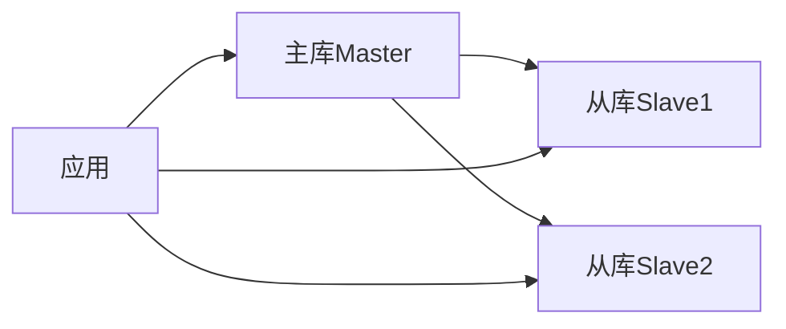

# MySQL性能优化指南：从SQL到架构

数据库性能直接影响应用响应速度。本文将从SQL优化、索引设计、执行计划分析、架构优化等多个维度，系统讲解MySQL性能优化实践。

## 一、SQL语句优化

### 1.1 查询优化原则

**避免SELECT ***:

```sql
-- 不推荐
SELECT * FROM users WHERE status = 1;

-- 推荐
SELECT id, username, email FROM users WHERE status = 1;
```

**使用索引列查询**:

```sql
-- 确保WHERE、ORDER BY、GROUP BY使用索引列
SELECT id, name FROM users WHERE username = 'admin';

-- 避免在索引列上使用函数
-- 不推荐
SELECT * FROM users WHERE YEAR(create_time) = 2024;

-- 推荐
SELECT * FROM users WHERE create_time >= '2024-01-01' AND create_time < '2025-01-01';
```

### 1.2 避免全表扫描

**LIKE查询优化**:

```sql
-- 不推荐（前缀模糊查询无法使用索引）
SELECT * FROM users WHERE name LIKE '%张%';

-- 推荐（后缀模糊可以使用索引）
SELECT * FROM users WHERE name LIKE '张%';
```

**避免NULL判断**:

```sql
-- 不推荐
SELECT * FROM users WHERE phone IS NULL;

-- 推荐（设置默认值）
SELECT * FROM users WHERE phone = '';
```

**避免OR操作**:

```sql
-- 不推荐
SELECT * FROM users WHERE status = 1 OR status = 2;

-- 推荐
SELECT * FROM users WHERE status IN (1, 2);
```

### 1.3 JOIN优化

**小表驱动大表**:

```sql
-- 小表在左
SELECT u.name, o.order_no 
FROM users u 
INNER JOIN orders o ON u.id = o.user_id;

-- 避免JOIN过多表（建议不超过3个）
```

**JOIN字段建立索引**:

```sql
CREATE INDEX idx_user_id ON orders(user_id);
```

### 1.4 分页优化

**传统分页问题**:

```sql
-- 深分页性能差
SELECT * FROM users LIMIT 10000, 20;
```

**优化方案1：覆盖索引**:

```sql
SELECT u.* FROM users u
INNER JOIN (
    SELECT id FROM users ORDER BY id LIMIT 10000, 20
) t ON u.id = t.id;
```

**优化方案2：游标分页**:

```sql
-- 记住上一页最后ID
SELECT * FROM users WHERE id > 10000 ORDER BY id LIMIT 20;
```

## 二、索引设计

### 2.1 索引类型

| 索引类型 | 特点 | 适用场景 |
|---------|------|---------|
| 主键索引 | 唯一、非空 | 主键字段 |
| 唯一索引 | 唯一性约束 | 唯一字段 |
| 普通索引 | 加速查询 | 频繁查询字段 |
| 复合索引 | 多列组合 | 多条件查询 |
| 全文索引 | 文本搜索 | 文本字段 |

### 2.2 索引设计原则

**最左前缀原则**:

```sql
-- 复合索引
CREATE INDEX idx_name_status_time ON users(name, status, create_time);

-- 可以使用索引
WHERE name = '张三'
WHERE name = '张三' AND status = 1
WHERE name = '张三' AND status = 1 AND create_time > '2024-01-01'

-- 无法使用索引
WHERE status = 1
WHERE create_time > '2024-01-01'
```

**索引选择性**:

```sql
-- 查看字段区分度
SELECT 
    COUNT(DISTINCT status) / COUNT(*) AS status_selectivity,
    COUNT(DISTINCT user_id) / COUNT(*) AS user_selectivity
FROM orders;

-- 选择性高的字段建立索引
-- status: 0.05（低） -> 不适合单独建索引
-- user_id: 0.95（高） -> 适合建索引
```

### 2.3 创建索引

```sql
-- 普通索引
CREATE INDEX idx_user_id ON orders(user_id);

-- 复合索引
CREATE INDEX idx_user_status_time ON orders(user_id, status, create_time);

-- 唯一索引
CREATE UNIQUE INDEX idx_username ON users(username);

-- 前缀索引（长字符串）
CREATE INDEX idx_content ON articles(content(100));

-- 全文索引
CREATE FULLTEXT INDEX idx_title ON articles(title, content);
```

### 2.4 索引维护

**查看索引使用情况**:

```sql
SHOW INDEX FROM users;

-- 查看索引基数
SELECT 
    TABLE_NAME,
    INDEX_NAME,
    CARDINALITY,
    SEQ_IN_INDEX
FROM information_schema.STATISTICS
WHERE TABLE_SCHEMA = 'mydb' AND TABLE_NAME = 'users';
```

**删除冗余索引**:

```sql
-- 删除索引
DROP INDEX idx_name ON users;

-- 查找未使用索引
SELECT * FROM sys.schema_unused_indexes 
WHERE object_schema = 'mydb';
```

## 三、执行计划分析

### 3.1 EXPLAIN使用

```sql
EXPLAIN SELECT * FROM users WHERE username = 'admin';
```

**关键字段解读**:

| 字段 | 含义 | 关注点 |
|------|------|--------|
| id | 查询标识 | 相同ID从上往下执行 |
| select_type | 查询类型 | SIMPLE最好 |
| type | 访问类型 | const > ref > range > index > ALL |
| key | 使用索引 | 是否命中索引 |
| rows | 扫描行数 | 越少越好 |
| Extra | 额外信息 | Using filesort需优化 |

**type类型从优到差**:

```
system > const > eq_ref > ref > range > index > ALL
```

### 3.2 优化案例

**案例1：全表扫描优化**:

```sql
-- 原SQL
EXPLAIN SELECT * FROM orders WHERE YEAR(create_time) = 2024;
-- type: ALL, rows: 100000

-- 优化后
EXPLAIN SELECT * FROM orders 
WHERE create_time >= '2024-01-01' AND create_time < '2025-01-01';
-- type: range, rows: 10000
```

**案例2：文件排序优化**:

```sql
-- 原SQL
EXPLAIN SELECT * FROM users ORDER BY create_time LIMIT 100;
-- Extra: Using filesort

-- 优化：在排序列建索引
CREATE INDEX idx_create_time ON users(create_time);
-- Extra: Using index
```

### 3.3 慢查询分析

**开启慢查询日志**:

```sql
SET GLOBAL slow_query_log = ON;
SET GLOBAL long_query_time = 1;  -- 超过1秒记录
SET GLOBAL slow_query_log_file = '/var/log/mysql/slow.log';
```

**分析慢查询**:

```bash
# 使用mysqldumpslow分析
mysqldumpslow -s t -t 10 /var/log/mysql/slow.log
```

## 四、表结构优化

### 4.1 字段类型选择

**整数类型**:

```sql
-- TINYINT: 1字节, 范围 -128~127
-- SMALLINT: 2字节
-- MEDIUMINT: 3字节
-- INT: 4字节
-- BIGINT: 8字节

-- 状态字段用TINYINT
status TINYINT DEFAULT 0;

-- 主键用BIGINT
id BIGINT PRIMARY KEY AUTO_INCREMENT;
```

**字符串类型**:

```sql
-- 定长 vs 变长
-- CHAR: 定长, 适合固定长度（如MD5、手机号）
phone CHAR(11);

-- VARCHAR: 变长, 节省空间
name VARCHAR(50);

-- TEXT: 长文本
content TEXT;
```

**时间类型**:

```sql
-- DATETIME: 8字节, 范围广
create_time DATETIME DEFAULT CURRENT_TIMESTAMP;

-- TIMESTAMP: 4字节, 自动时区转换
update_time TIMESTAMP DEFAULT CURRENT_TIMESTAMP ON UPDATE CURRENT_TIMESTAMP;
```

### 4.2 范式与反范式

**范式化**:

```sql
-- 用户表
CREATE TABLE users (
    id INT PRIMARY KEY,
    name VARCHAR(50)
);

-- 订单表（范式化）
CREATE TABLE orders (
    id INT PRIMARY KEY,
    user_id INT,
    FOREIGN KEY (user_id) REFERENCES users(id)
);
```

**反范式化（提升查询性能）**:

```sql
-- 订单表冗余用户名
CREATE TABLE orders (
    id INT PRIMARY KEY,
    user_id INT,
    user_name VARCHAR(50),  -- 冗余字段
    INDEX idx_user_id (user_id)
);
```

### 4.3 垂直拆分

```sql
-- 原表
CREATE TABLE users (
    id INT PRIMARY KEY,
    name VARCHAR(50),
    phone VARCHAR(20),
    profile TEXT,      -- 大字段
    avatar BLOB        -- 大字段
);

-- 拆分为两个表
CREATE TABLE users_base (
    id INT PRIMARY KEY,
    name VARCHAR(50),
    phone VARCHAR(20)
);

CREATE TABLE users_profile (
    user_id INT PRIMARY KEY,
    profile TEXT,
    avatar BLOB
);
```

## 五、事务与锁优化

### 5.1 事务隔离级别

| 隔离级别 | 脏读 | 不可重复读 | 幻读 | 性能 |
|---------|------|-----------|------|------|
| READ UNCOMMITTED | ✓ | ✓ | ✓ | 最高 |
| READ COMMITTED | ✗ | ✓ | ✓ | 高 |
| REPEATABLE READ | ✗ | ✗ | ✓ | 中 |
| SERIALIZABLE | ✗ | ✗ | ✗ | 低 |

```sql
-- 查看隔离级别
SELECT @@transaction_isolation;

-- 设置隔离级别
SET SESSION TRANSACTION ISOLATION LEVEL READ COMMITTED;
```

### 5.2 锁优化

**避免长事务**:

```sql
-- 不推荐
START TRANSACTION;
-- 执行大量操作
COMMIT;

-- 推荐：小事务
START TRANSACTION;
UPDATE accounts SET balance = balance - 100 WHERE id = 1;
COMMIT;
```

**乐观锁实现**:

```sql
-- 添加版本号字段
ALTER TABLE products ADD COLUMN version INT DEFAULT 0;

-- 更新时检查版本
UPDATE products 
SET stock = stock - 1, version = version + 1 
WHERE id = 1 AND version = 5;

-- 影响行数为0说明版本已变更
```

## 六、架构优化

### 6.1 读写分离



**配置主从复制**:

```sql
-- 主库配置
[mysqld]
server-id = 1
log-bin = mysql-bin

-- 从库配置
[mysqld]
server-id = 2
relay-log = relay-bin
```

### 6.2 分库分表

**垂直分库**:

```
用户库: users, profiles
订单库: orders, order_items
商品库: products, categories
```

**水平分表**:

```sql
-- 按ID范围分表
orders_0: id 1-1000000
orders_1: id 1000001-2000000

-- 按哈希分表
orders_0: user_id % 2 = 0
orders_1: user_id % 2 = 1
```

### 6.3 缓存层

```sql
-- 查询缓存（MySQL 8.0已移除）
-- 推荐使用Redis等外部缓存

-- 应用层缓存策略
1. 查询先查缓存
2. 缓存未命中再查数据库
3. 结果写入缓存
```

## 七、监控与维护

### 7.1 性能监控

**查看连接数**:

```sql
SHOW STATUS LIKE 'Threads_connected';
SHOW PROCESSLIST;
```

**查看缓冲池**:

```sql
SHOW STATUS LIKE 'Innodb_buffer_pool%';

-- 缓冲池命中率
Innodb_buffer_pool_read_requests / 
(Innodb_buffer_pool_read_requests + Innodb_buffer_pool_reads)
```

### 7.2 定期维护

**优化表**:

```sql
OPTIMIZE TABLE users;
```

**分析表**:

```sql
ANALYZE TABLE users;
```

**检查表**:

```sql
CHECK TABLE users;
```

## 八、总结

### 8.1 优化优先级

1. SQL语句优化
2. 索引设计
3. 表结构优化
4. 架构优化

### 8.2 优化检查清单

- [ ] 慢查询是否已分析
- [ ] 索引是否命中
- [ ] 是否存在全表扫描
- [ ] 连接数是否合理
- [ ] 缓冲池命中率如何
- [ ] 是否有长事务
- [ ] 是否需要分库分表

---

**下一步学习**：
- [Redis缓存实践](/backend/database/redis-cache)
- [MongoDB使用指南](/backend/database/mongodb-guide)
- [数据库分库分表实战](/backend/database/sharding-practice)