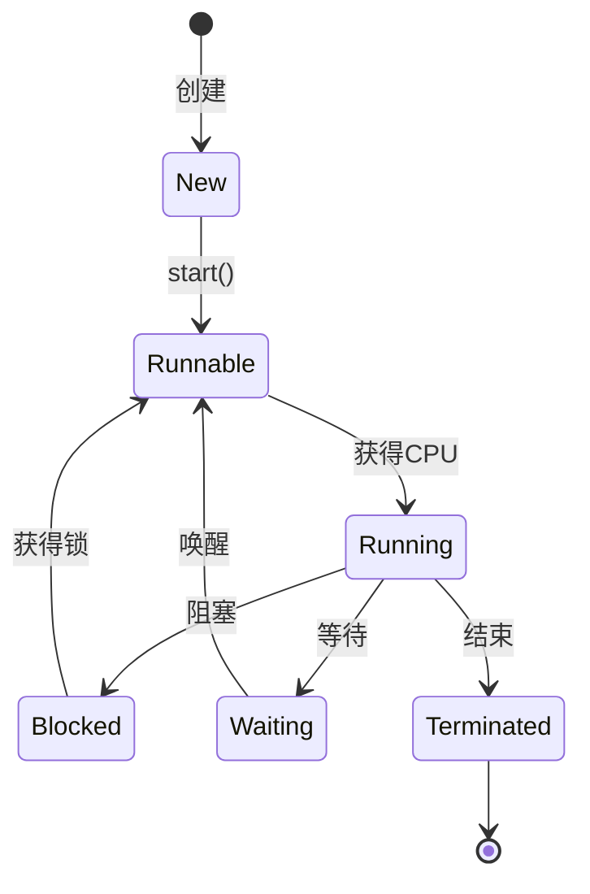

# Java并发编程实践：从原理到应用

并发编程是Java开发者必须掌握的核心技能。本文将从线程基础出发，逐步深入到并发工具类和最佳实践，帮助你建立完整的知识体系。

## 一、并发基础

### 1.1 线程与进程

**进程**：操作系统资源分配的最小单位
**线程**：CPU调度的最小单位，一个进程包含多个线程

```java
public class ThreadExample {
    public static void main(String[] args) {
        // 方式1：继承Thread类
        Thread thread1 = new Thread(() -> {
            System.out.println("线程1运行: " + Thread.currentThread().getName());
        });
        
        // 方式2：实现Runnable接口
        Runnable task = () -> {
            System.out.println("线程2运行: " + Thread.currentThread().getName());
        };
        Thread thread2 = new Thread(task);
        
        // 启动线程
        thread1.start();
        thread2.start();
    }
}
```

### 1.2 线程生命周期



**线程状态**：
- NEW：新建状态
- RUNNABLE：可运行状态
- BLOCKED：阻塞状态
- WAITING：等待状态
- TIMED_WAITING：超时等待
- TERMINATED：终止状态

```java
public class ThreadState {
    public static void main(String[] args) throws InterruptedException {
        Thread thread = new Thread(() -> {
            try {
                Thread.sleep(1000);
            } catch (InterruptedException e) {
                e.printStackTrace();
            }
        });
        
        System.out.println("创建后状态: " + thread.getState()); // NEW
        
        thread.start();
        System.out.println("启动后状态: " + thread.getState()); // RUNNABLE
        
        Thread.sleep(100);
        System.out.println("运行中状态: " + thread.getState()); // TIMED_WAITING
        
        thread.join();
        System.out.println("结束后状态: " + thread.getState()); // TERMINATED
    }
}
```

### 1.3 线程安全

**问题：共享变量的可见性与原子性**

```java
public class ThreadUnsafe {
    private static int count = 0;
    
    public static void main(String[] args) throws InterruptedException {
        Thread t1 = new Thread(() -> {
            for (int i = 0; i < 10000; i++) count++;
        });
        
        Thread t2 = new Thread(() -> {
            for (int i = 0; i < 10000; i++) count++;
        });
        
        t1.start();
        t2.start();
        t1.join();
        t2.join();
        
        System.out.println("计数结果: " + count); // 结果可能小于20000
    }
}
```

**解决方案**：

```java
// 方案1：synchronized
public synchronized static void increment() {
    count++;
}

// 方案2：Atomic类
private static AtomicInteger count = new AtomicInteger(0);
public static void increment() {
    count.incrementAndGet();
}

// 方案3：ReentrantLock
private static ReentrantLock lock = new ReentrantLock();
public static void increment() {
    lock.lock();
    try {
        count++;
    } finally {
        lock.unlock();
    }
}
```

## 二、锁机制

### 2.1 synchronized关键字

**三种使用方式**：

```java
public class SynchronizedDemo {
    private final Object lock = new Object();
    
    // 1. 同步实例方法（锁当前实例）
    public synchronized void instanceMethod() {
        // 临界区
    }
    
    // 2. 同步静态方法（锁Class对象）
    public synchronized static void staticMethod() {
        // 临界区
    }
    
    // 3. 同步代码块
    public void blockMethod() {
        synchronized (lock) {
            // 临界区
        }
    }
}
```

**锁升级过程**：

```
无锁 → 偏向锁 → 轻量级锁 → 重量级锁
```

### 2.2 ReentrantLock

**可重入锁的特性**：

```java
public class ReentrantLockDemo {
    private final ReentrantLock lock = new ReentrantLock(true); // 公平锁
    
    public void method() {
        lock.lock();
        try {
            // 临界区代码
            System.out.println("持有锁次数: " + lock.getHoldCount());
            innerMethod(); // 可重入
        } finally {
            lock.unlock();
        }
    }
    
    public void innerMethod() {
        lock.lock();
        try {
            System.out.println("内部方法持有锁");
        } finally {
            lock.unlock();
        }
    }
    
    // 尝试获取锁
    public void tryLockExample() {
        if (lock.tryLock()) {
            try {
                // 获取锁成功
            } finally {
                lock.unlock();
            }
        } else {
            // 获取锁失败
        }
    }
}
```

### 2.3 ReadWriteLock

**读写分离锁**：

```java
public class ReadWriteLockDemo {
    private final ReentrantReadWriteLock rwLock = new ReentrantReadWriteLock();
    private final Lock readLock = rwLock.readLock();
    private final Lock writeLock = rwLock.writeLock();
    private Map<String, Object> cache = new HashMap<>();
    
    // 读操作（共享锁）
    public Object read(String key) {
        readLock.lock();
        try {
            return cache.get(key);
        } finally {
            readLock.unlock();
        }
    }
    
    // 写操作（排他锁）
    public void write(String key, Object value) {
        writeLock.lock();
        try {
            cache.put(key, value);
        } finally {
            writeLock.unlock();
        }
    }
}
```

### 2.4 StampedLock（Java 8+）

**乐观读锁**：

```java
public class StampedLockDemo {
    private final StampedLock stampedLock = new StampedLock();
    private double x, y;
    
    // 写锁
    public void move(double deltaX, double deltaY) {
        long stamp = stampedLock.writeLock();
        try {
            x += deltaX;
            y += deltaY;
        } finally {
            stampedLock.unlockWrite(stamp);
        }
    }
    
    // 乐观读
    public double distanceFromOrigin() {
        long stamp = stampedLock.tryOptimisticRead();
        double currentX = x, currentY = y;
        
        if (!stampedLock.validate(stamp)) {
            stamp = stampedLock.readLock();
            try {
                currentX = x;
                currentY = y;
            } finally {
                stampedLock.unlockRead(stamp);
            }
        }
        
        return Math.sqrt(currentX * currentX + currentY * currentY);
    }
}
```

## 三、JUC工具类

### 3.1 CountDownLatch

**等待多个线程完成**：

```java
public class CountDownLatchDemo {
    public static void main(String[] args) throws InterruptedException {
        int threadCount = 5;
        CountDownLatch latch = new CountDownLatch(threadCount);
        
        for (int i = 0; i < threadCount; i++) {
            new Thread(() -> {
                try {
                    Thread.sleep(1000);
                    System.out.println(Thread.currentThread().getName() + " 完成");
                } catch (InterruptedException e) {
                    e.printStackTrace();
                } finally {
                    latch.countDown();
                }
            }).start();
        }
        
        latch.await(); // 等待所有线程完成
        System.out.println("所有线程已完成");
    }
}
```

### 3.2 CyclicBarrier

**线程栅栏**：

```java
public class CyclicBarrierDemo {
    public static void main(String[] args) {
        int parties = 3;
        CyclicBarrier barrier = new CyclicBarrier(parties, () -> {
            System.out.println("所有线程到达栅栏，开始下一阶段");
        });
        
        for (int i = 0; i < parties; i++) {
            new Thread(() -> {
                try {
                    System.out.println(Thread.currentThread().getName() + " 到达栅栏");
                    barrier.await();
                    System.out.println(Thread.currentThread().getName() + " 继续执行");
                } catch (Exception e) {
                    e.printStackTrace();
                }
            }).start();
        }
    }
}
```

### 3.3 Semaphore

**信号量控制并发数**：

```java
public class SemaphoreDemo {
    public static void main(String[] args) {
        int permits = 3; // 同时最多3个线程访问
        Semaphore semaphore = new Semaphore(permits);
        
        for (int i = 0; i < 10; i++) {
            new Thread(() -> {
                try {
                    semaphore.acquire();
                    System.out.println(Thread.currentThread().getName() + " 获取许可");
                    Thread.sleep(1000);
                } catch (InterruptedException e) {
                    e.printStackTrace();
                } finally {
                    semaphore.release();
                    System.out.println(Thread.currentThread().getName() + " 释放许可");
                }
            }).start();
        }
    }
}
```

### 3.4 Exchanger

**线程间数据交换**：

```java
public class ExchangerDemo {
    public static void main(String[] args) {
        Exchanger<String> exchanger = new Exchanger<>();
        
        new Thread(() -> {
            try {
                String data = "来自线程A的数据";
                String received = exchanger.exchange(data);
                System.out.println("线程A收到: " + received);
            } catch (InterruptedException e) {
                e.printStackTrace();
            }
        }).start();
        
        new Thread(() -> {
            try {
                String data = "来自线程B的数据";
                String received = exchanger.exchange(data);
                System.out.println("线程B收到: " + received);
            } catch (InterruptedException e) {
                e.printStackTrace();
            }
        }).start();
    }
}
```

## 四、并发容器

### 4.1 ConcurrentHashMap

**线程安全的HashMap**：

```java
public class ConcurrentHashMapDemo {
    public static void main(String[] args) throws InterruptedException {
        ConcurrentHashMap<String, Integer> map = new ConcurrentHashMap<>();
        
        // 多线程安全写入
        Thread t1 = new Thread(() -> {
            for (int i = 0; i < 1000; i++) {
                map.put("key" + i, i);
            }
        });
        
        Thread t2 = new Thread(() -> {
            for (int i = 1000; i < 2000; i++) {
                map.put("key" + i, i);
            }
        });
        
        t1.start();
        t2.start();
        t1.join();
        t2.join();
        
        System.out.println("Map大小: " + map.size());
        
        // 原子操作
        map.computeIfAbsent("newKey", k -> 999);
        map.merge("key0", 1, Integer::sum);
    }
}
```

### 4.2 CopyOnWriteArrayList

**写时复制列表**：

```java
public class CopyOnWriteDemo {
    public static void main(String[] args) {
        CopyOnWriteArrayList<String> list = new CopyOnWriteArrayList<>();
        
        // 适合读多写少场景
        list.add("元素1");
        list.add("元素2");
        
        // 迭代过程安全（快照）
        for (String s : list) {
            System.out.println(s);
            list.add("新元素"); // 不会抛ConcurrentModificationException
        }
        
        System.out.println("最终列表: " + list);
    }
}
```

### 4.3 BlockingQueue

**阻塞队列**：

```java
public class BlockingQueueDemo {
    public static void main(String[] args) {
        ArrayBlockingQueue<String> queue = new ArrayBlockingQueue<>(10);
        
        // 生产者
        new Thread(() -> {
            try {
                for (int i = 0; i < 20; i++) {
                    queue.put("消息" + i);
                    System.out.println("生产: 消息" + i);
                }
            } catch (InterruptedException e) {
                e.printStackTrace();
            }
        }).start();
        
        // 消费者
        new Thread(() -> {
            try {
                while (true) {
                    String msg = queue.take();
                    System.out.println("消费: " + msg);
                    Thread.sleep(100);
                }
            } catch (InterruptedException e) {
                e.printStackTrace();
            }
        }).start();
    }
}
```

## 五、线程池

### 5.1 ThreadPoolExecutor

**核心参数**：

```java
public class ThreadPoolDemo {
    public static void main(String[] args) {
        ThreadPoolExecutor executor = new ThreadPoolExecutor(
            2,                      // 核心线程数
            5,                      // 最大线程数
            60L,                    // 空闲线程存活时间
            TimeUnit.SECONDS,       // 时间单位
            new ArrayBlockingQueue<>(10),  // 工作队列
            Executors.defaultThreadFactory(),
            new ThreadPoolExecutor.CallerRunsPolicy() // 拒绝策略
        );
        
        for (int i = 0; i < 20; i++) {
            final int taskId = i;
            executor.execute(() -> {
                System.out.println("任务" + taskId + " 执行线程: " + 
                    Thread.currentThread().getName());
                try {
                    Thread.sleep(1000);
                } catch (InterruptedException e) {
                    e.printStackTrace();
                }
            });
        }
        
        executor.shutdown();
    }
}
```

### 5.2 Executors工厂方法

**预定义线程池**：

```java
// 固定大小线程池
ExecutorService fixedPool = Executors.newFixedThreadPool(5);

// 缓存线程池（适合短期异步任务）
ExecutorService cachedPool = Executors.newCachedThreadPool();

// 单线程执行器
ExecutorService singlePool = Executors.newSingleThreadExecutor();

// 定时任务线程池
ScheduledExecutorService scheduledPool = Executors.newScheduledThreadPool(3);
scheduledPool.scheduleAtFixedRate(() -> {
    System.out.println("定时任务执行: " + System.currentTimeMillis());
}, 0, 1, TimeUnit.SECONDS);
```

### 5.3 CompletableFuture（Java 8+）

**异步编程**：

```java
public class CompletableFutureDemo {
    public static void main(String[] args) {
        // 异步执行
        CompletableFuture<String> future = CompletableFuture.supplyAsync(() -> {
            try {
                Thread.sleep(1000);
            } catch (InterruptedException e) {
                e.printStackTrace();
            }
            return "Hello";
        });
        
        // 链式调用
        future.thenApply(s -> s + " World")
              .thenAccept(System.out::println)
              .thenRun(() -> System.out.println("完成"));
        
        // 组合多个Future
        CompletableFuture<Integer> future1 = CompletableFuture.supplyAsync(() -> 10);
        CompletableFuture<Integer> future2 = CompletableFuture.supplyAsync(() -> 20);
        
        future1.thenCombine(future2, Integer::sum)
               .thenAccept(sum -> System.out.println("和: " + sum));
        
        // 等待完成
        CompletableFuture.allOf(future, future1, future2).join();
    }
}
```

## 六、最佳实践

### 6.1 避免死锁

```java
public class DeadlockAvoidance {
    private static final Object lock1 = new Object();
    private static final Object lock2 = new Object();
    
    // 错误示例：可能导致死锁
    public void deadlockExample() {
        new Thread(() -> {
            synchronized (lock1) {
                synchronized (lock2) {
                    // 临界区
                }
            }
        }).start();
        
        new Thread(() -> {
            synchronized (lock2) {
                synchronized (lock1) {
                    // 临界区
                }
            }
        }).start();
    }
    
    // 正确做法：统一锁顺序
    public void safeExample() {
        new Thread(() -> {
            synchronized (lock1) {
                synchronized (lock2) {
                    // 临界区
                }
            }
        }).start();
        
        new Thread(() -> {
            synchronized (lock1) {  // 保持相同顺序
                synchronized (lock2) {
                    // 临界区
                }
            }
        }).start();
    }
}
```

### 6.2 正确关闭线程池

```java
public class ThreadPoolShutdown {
    public static void main(String[] args) {
        ExecutorService executor = Executors.newFixedThreadPool(5);
        
        // 提交任务...
        
        // 优雅关闭
        executor.shutdown();  // 不再接受新任务
        
        try {
            if (!executor.awaitTermination(60, TimeUnit.SECONDS)) {
                executor.shutdownNow();  // 强制关闭
            }
        } catch (InterruptedException e) {
            executor.shutdownNow();
        }
    }
}
```

### 6.3 ThreadLocal使用注意

```java
public class ThreadLocalDemo {
    private static ThreadLocal<SimpleDateFormat> dateFormat = 
        ThreadLocal.withInitial(() -> new SimpleDateFormat("yyyy-MM-dd"));
    
    public String formatDate(Date date) {
        return dateFormat.get().format(date);
    }
    
    // 重要：在线程池环境中使用后必须清理
    public void cleanUp() {
        dateFormat.remove();
    }
}
```

## 七、总结

### 7.1 并发编程核心要点

1. **可见性**：volatile、synchronized、final
2. **原子性**：synchronized、Lock、Atomic类
3. **有序性**：happens-before原则

### 7.2 工具选型

| 需求 | 推荐工具 |
|------|---------|
| 简单互斥 | synchronized |
| 灵活控制 | ReentrantLock |
| 读多写少 | ReadWriteLock |
| 计数等待 | CountDownLatch |
| 屏障同步 | CyclicBarrier |
| 并发控制 | Semaphore |
| 异步任务 | CompletableFuture |

---

**下一步学习**：
- [JVM内存模型](/backend/java/jvm-memory-model)
- [Spring并发编程](/backend/spring/spring-concurrency)
- [分布式锁实现](/backend/architecture/distributed-lock)