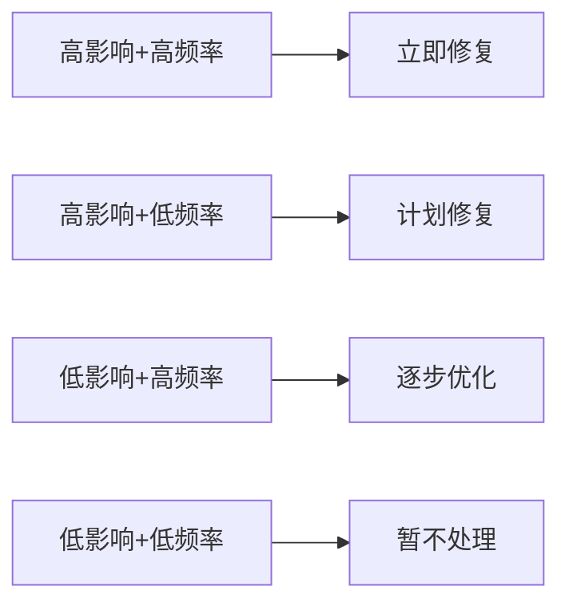

# 技术债务管理心得：平衡速度与质量

技术债务是每个项目都会面临的挑战。本文分享在实践中积累的技术债务管理经验。

## 一、理解技术债务

### 1.1 什么是技术债务

技术债务是**为了短期目标而做出的技术妥协**，需要在未来付出额外成本弥补。

类比金融债务：
- 有意为之的债务：为了快速上线功能
- 无意产生的债务：知识不足或疏忽导致

### 1.2 常见类型

| 类型 | 示例 | 影响 |
|------|------|------|
| 代码债务 | 重复代码、过长函数 | 维护成本高 |
| 架构债务 | 模块耦合严重 | 扩展困难 |
| 测试债务 | 测试覆盖不足 | 质量风险 |
| 文档债务 | 缺少文档 | 知识传承难 |
| 依赖债务 | 过时依赖 | 安全风险 |

## 二、识别技术债务

### 2.1 代码异味检测

**常见代码异味**：

- 重复代码（DRY原则）
- 过长函数（> 50行）
- 过大类（> 500行）
- 过多参数（> 5个）
- 注释过多（说明代码不清晰）

### 2.2 静态分析工具

```bash
# SonarQube扫描
sonar-scanner

# ESLint检测
eslint src/

# Checkstyle（Java）
checkstyle -c google_checks.xml src/
```

### 2.3 团队反馈

定期开展**代码评审**和**技术分享会**，收集团队感知的技术问题。

## 三、评估技术债务

### 3.1 影响评估矩阵

| 维度 | 低影响 | 高影响 |
|------|--------|--------|
| 频率 | 偶尔触发 | 频繁触发 |
| 范围 | 局部模块 | 核心功能 |
| 风险 | 低风险 | 高风险 |
| 成本 | 低修复成本 | 高修复成本 |

### 3.2 优先级排序



## 四、偿还技术债务

### 4.1 渐进式重构

**策略**：
1. 小步快跑，每次改动可测试
2. 保持功能不变，只改结构
3. 编写测试保护网

**示例**：

```java
// 原代码
public void process() {
    // 大量逻辑
}

// 重构步骤1：提取方法
public void process() {
    validateInput();
    doProcess();
    handleResult();
}

// 重构步骤2：抽取类
public class InputValidator {
    public void validate() { }
}
```

### 4.2 测试驱动

```java
// 先写测试
@Test
public void testProcess() {
    // 测试保护
}

// 再重构
public void process() {
    // 安全重构
}
```

### 4.3 时间分配

**20%规则**：
- 80%时间开发新功能
- 20%时间偿还技术债务

**迭代计划**：
每个Sprint预留1-2天处理技术债务。

## 五、预防技术债务

### 5.1 代码规范

- 统一代码风格
- Code Review机制
- 持续集成检查

### 5.2 设计原则

- SOLID原则
- DRY原则
- KISS原则
- YAGNI原则

### 5.3 测试策略

- 单元测试覆盖核心逻辑
- 集成测试保证接口正确
- 端到端测试验证关键路径

## 六、团队协作

### 6.1 沟通机制

- **技术债务登记**：维护债务清单
- **定期回顾**：每个迭代评估债务状态
- **透明度**：向业务方说明技术债务影响

### 6.2 文化建设

- **不指责文化**：技术债务是团队的，不是个人的
- **持续改进**：鼓励小步重构
- **知识分享**：定期技术分享

## 七、实战案例

### 7.1 案例一：遗留系统重构

**背景**：
单体应用，10年历史，代码耦合严重

**策略**：
1. 识别边界，逐步拆分
2. 绞杀者模式：新功能用新架构
3. 保持旧系统稳定运行

**结果**：
3年时间，成功拆分为微服务架构

### 7.2 案例二：测试债务偿还

**背景**：
测试覆盖率10%，回归问题频发

**策略**：
1. 核心模块优先补测试
2. 新功能强制测试覆盖
3. 工具辅助生成测试

**结果**：
6个月时间，覆盖率提升到70%

## 八、总结

技术债务管理是长期工程，关键在于：

1. **识别**：主动发现，不忽视
2. **评估**：量化影响，合理排序
3. **偿还**：小步重构，持续改进
4. **预防**：建立规范，源头控制

记住：**没有技术债务的项目不存在，关键是如何管理**。

---

**相关阅读**：
- [代码重构技巧](/blog/experiences/refactoring-skills)
- [Clean Code实践](/blog/experiences/clean-code-practice)