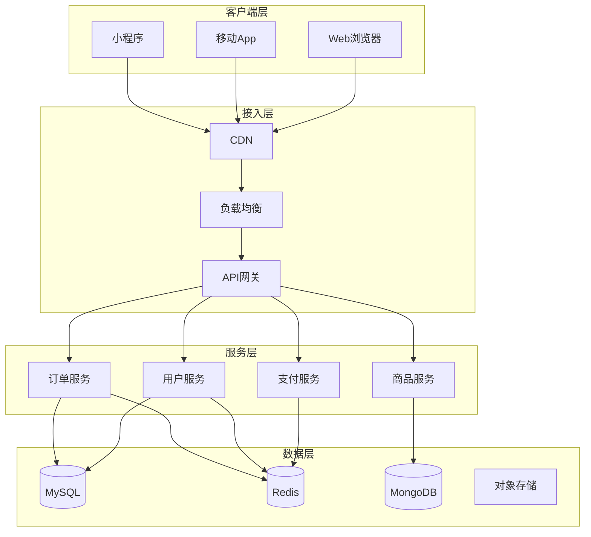
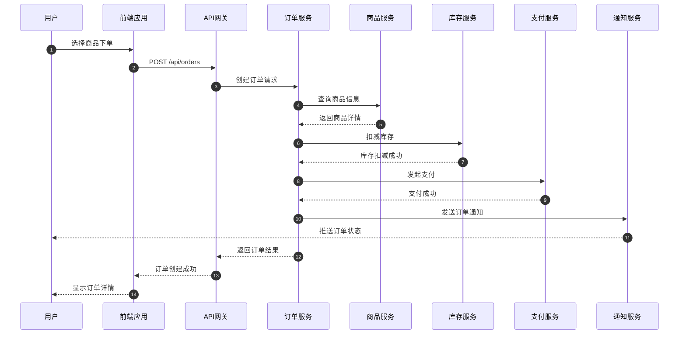
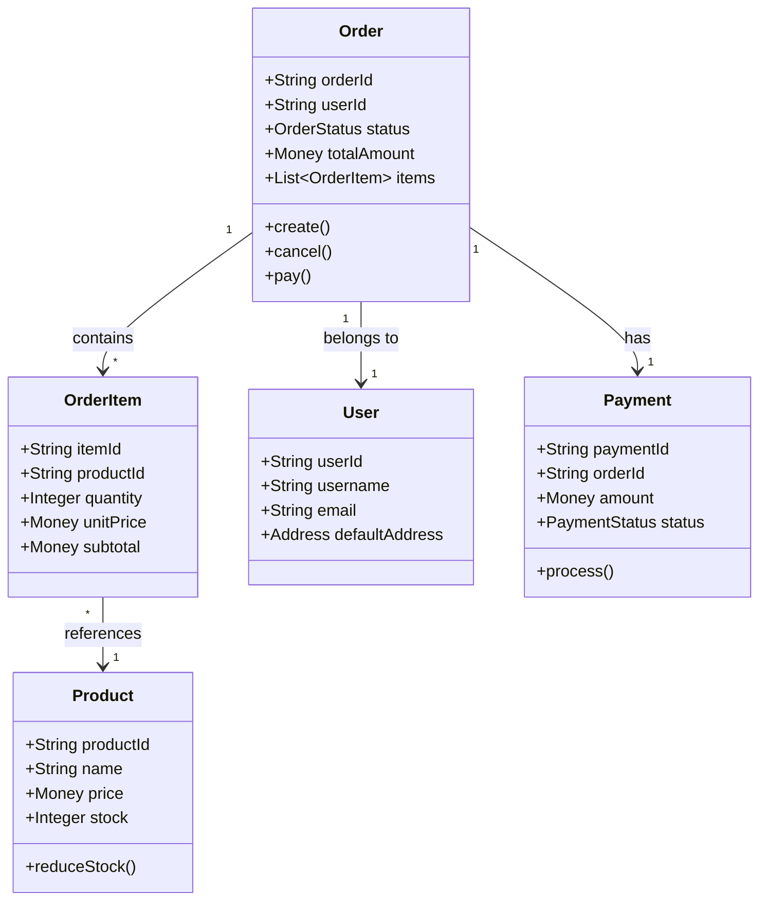
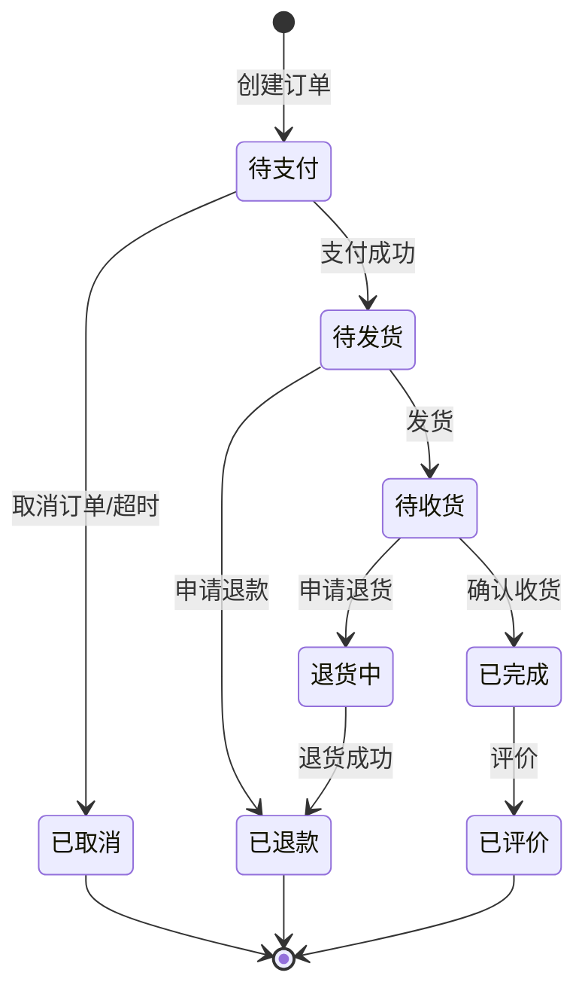
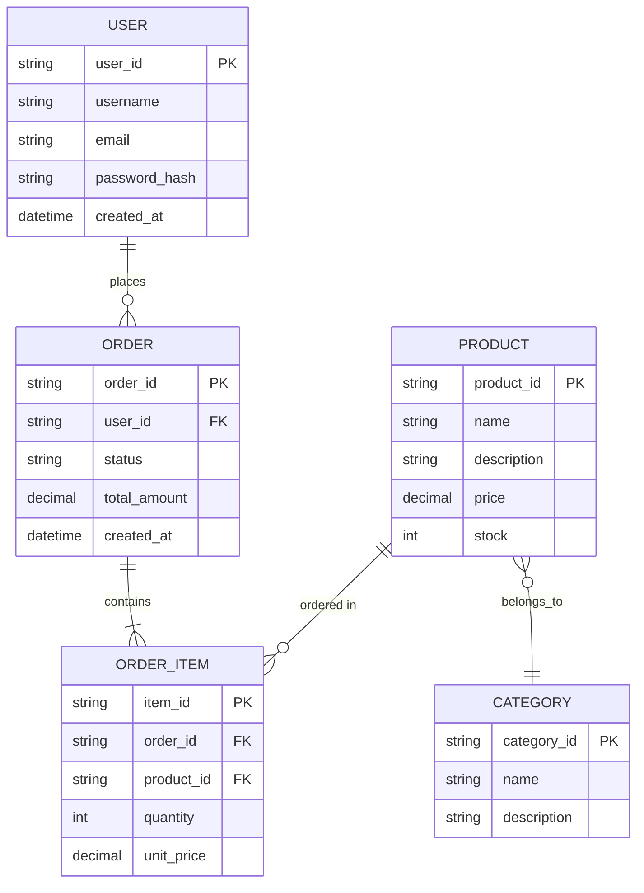
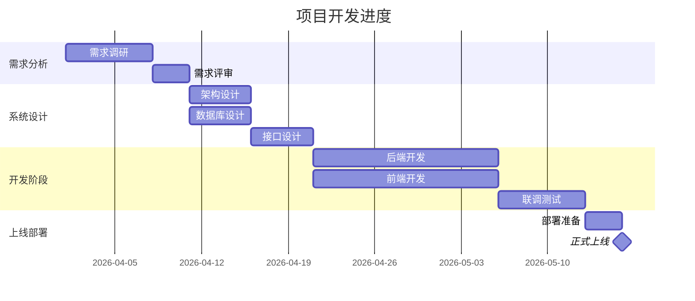
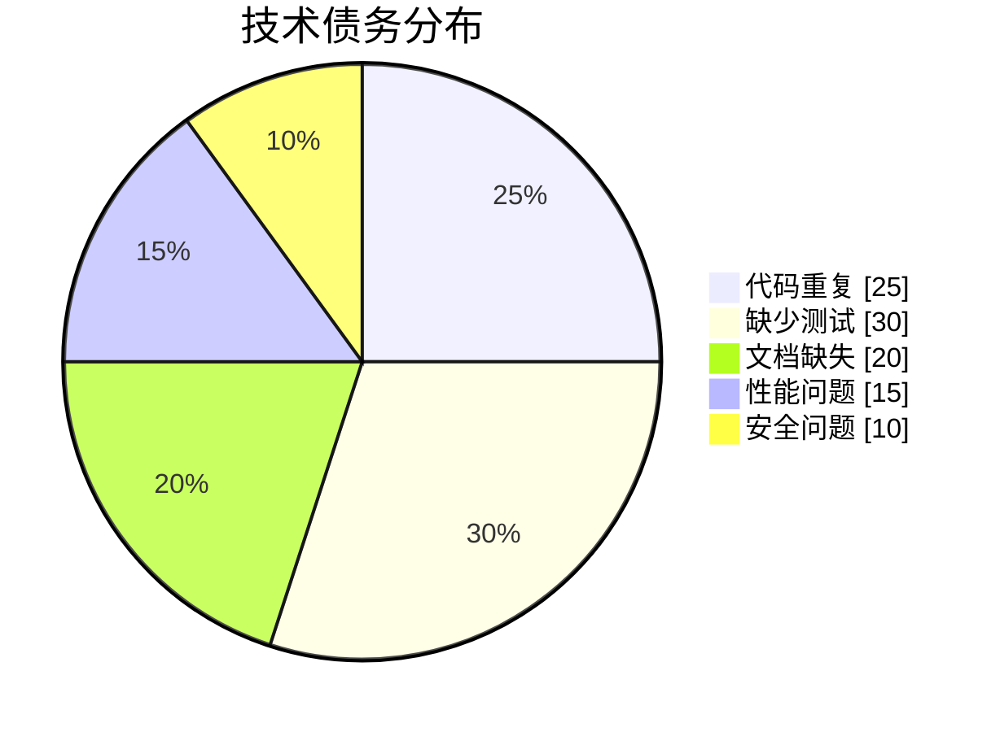
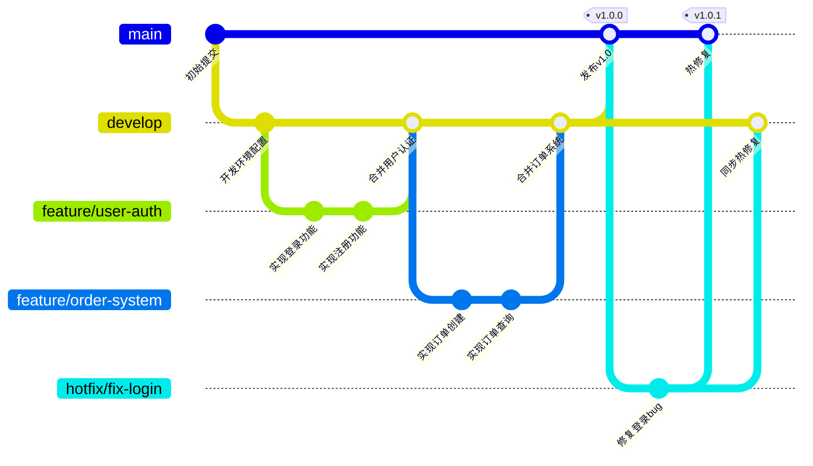
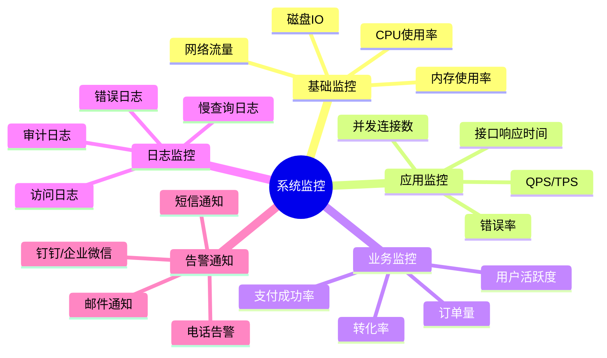
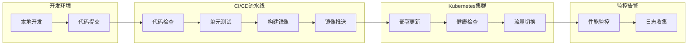

# 现代Web应用架构设计实践

随着互联网技术的发展，现代Web应用的架构设计面临着越来越多的挑战。本文将从多个维度探讨现代Web应用的架构设计实践。

## 一、系统架构概览

现代Web应用通常采用前后端分离的架构模式，下面是一个典型的系统架构图：

### 1.1 整体架构流程

### 1.2 技术栈选择

选择合适的技术栈是项目成功的关键因素之一：

## 二、核心服务设计

### 2.1 服务交互时序图

在微服务架构中，服务之间的交互是一个复杂的过程。以下是一个典型的用户下单流程：

### 2.2 领域模型设计

领域驱动设计（DDD）是微服务架构设计的核心思想：

## 三、状态管理

### 3.1 订单状态机

订单的生命周期管理是电商系统的核心功能：

### 3.2 状态管理最佳实践

在实际开发中，状态管理需要考虑以下因素：

- **状态持久化**：确保状态不丢失
- **并发控制**：防止状态冲突
- **状态回滚**：异常情况下的状态恢复

## 四、数据库设计

### 4.1 ER模型

良好的数据库设计是系统性能的基础：

## 五、项目规划

### 5.1 开发进度安排

合理的项目规划能够确保项目按时交付：

### 5.2 技术债务分布

## 六、Git工作流

### 6.1 分支管理策略

清晰的Git工作流能够提高团队协作效率：

### 6.2 代码评审流程

## 七、系统监控

### 7.1 思维导图

系统监控是保障系统稳定性的重要手段：

### 7.2 监控架构图

## 八、性能优化策略

性能优化是提升用户体验的关键：

### 8.1 前端优化

| 优化项 | 方法 | 预期收益 |
|--------|------|----------|
| 资源压缩 | Gzip/Brotli | 传输体积减少60%+ |
| 代码分割 | 懒加载/按需加载 | 首屏时间减少40% |
| 缓存策略 | Service Worker | 二次加载时间减少80% |
| 图片优化 | WebP/懒加载 | 图片体积减少50% |

### 8.2 后端优化

$$
响应时间 = \frac{CPU时间}{CPU数量 \times 利用率} + 等待时间
$$

性能优化公式表明，减少等待时间和提高CPU利用率是优化的核心。

## 九、部署架构

### 9.1 容器化部署

现代应用普遍采用容器化部署方案：

### 9.2 高可用架构

## 十、总结

现代Web应用架构设计是一个系统工程，需要从多个维度进行考量：

1. **架构层面**：选择合适的架构模式（微服务/单体）
2. **技术层面**：选择合适的技术栈和中间件
3. **流程层面**：建立完善的开发和运维流程
4. **监控层面**：建立全方位的监控告警体系

通过合理的架构设计，可以构建出高可用、高性能、易扩展的现代Web应用系统。

---

> 图片服务：[placehold.co](https://placehold.co/) - 专业前端占位图片服务