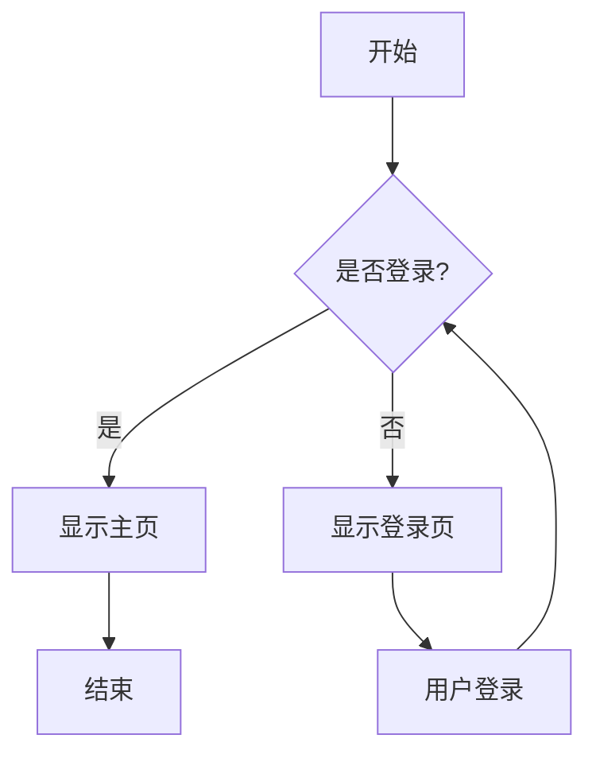
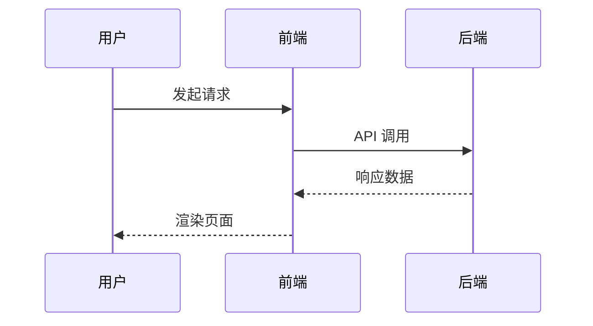
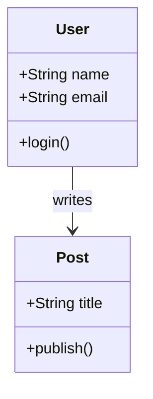

# Markdown 功能测试

## 一、Mermaid 图表测试

### 1.1 流程图



### 1.2 时序图



### 1.3 类图



## 二、数学公式测试

### 1.1 行内公式

爱因斯坦质能方程：$E = mc^2$，表示能量与质量的关系。

欧拉公式：$e^{i\pi} + 1 = 0$

### 1.2 块级公式

**牛顿第二定律：**

$$F = ma$$

**积分公式：**

$$
\int_{-\infty}^{\infty} e^{-x^2} dx = \sqrt{\pi}
$$

**矩阵：**

$$
\mathbf{A} = \begin{bmatrix}
a_{11} & a_{12} \\
a_{21} & a_{22}
\end{bmatrix}
$$

## 三、图片测试（Fancybox 点击放大）


点击图片可以放大查看（使用 Fancybox）。

## 四、代码块测试

```typescript
const greeting: string = 'Hello, VitePress!'
console.log(greeting)
```

## 五、表格测试

| 功能 | 状态 |
|------|------|
| Mermaid 图表 | ✅ |
| 数学公式 | ✅ |
| 图片放大 | ✅ |
| 代码高亮 | ✅ |