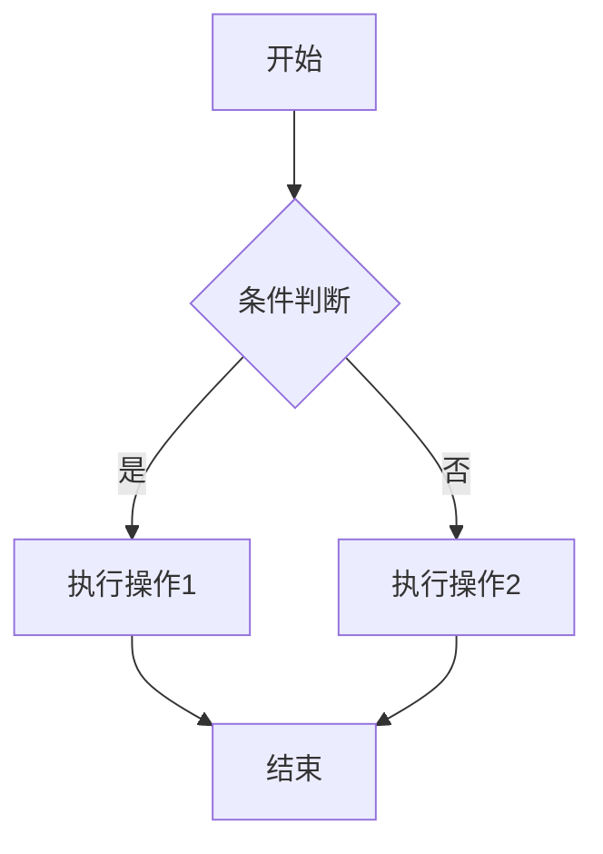
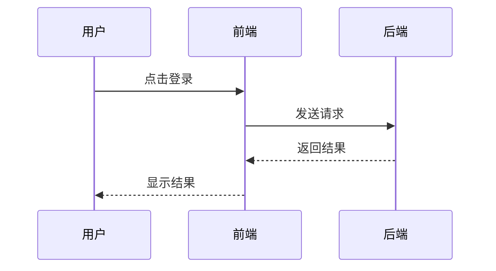
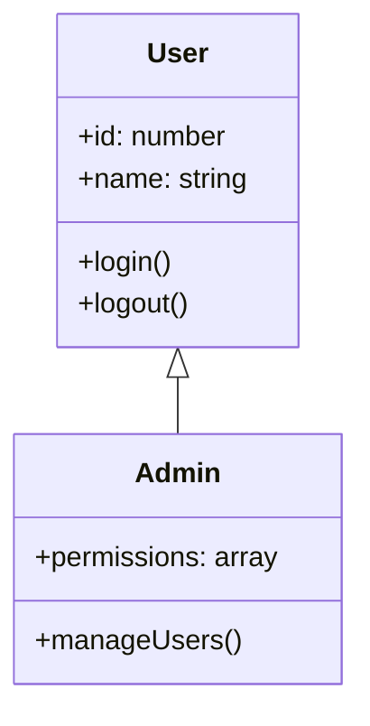

# Markdown写作技巧与实践

Markdown是一种轻量级标记语言，因其简洁的语法和强大的扩展能力，已经成为技术写作的主流工具。本文将介绍Markdown写作的进阶技巧和最佳实践。

## 一、Markdown基础回顾

### 1.1 核心语法

```markdown
# 一级标题
## 二级标题
### 三级标题

**粗体文本**
*斜体文本*
~~删除线文本~~

> 引用文本
> > 嵌套引用

- 无序列表项1
- 无序列表项2
  - 嵌套列表项

1. 有序列表项1
2. 有序列表项2

[链接文本](https://example.com)


`行内代码`

代码块：
​```javascript
function hello() {
  console.log('Hello, World!')
}
​```

---

表格：
| 列1 | 列2 | 列3 |
|-----|-----|-----|
| 数据1 | 数据2 | 数据3 |
```

### 1.2 语法要点

**标题层级**：合理使用标题层级，一般不超过四级。一级标题通常用于文章标题。

**段落分隔**：使用空行分隔段落，不要在段落内部使用换行。

**列表嵌套**：列表可以嵌套，使用缩进表示层级关系。

**代码块**：指定语言以获得语法高亮。

## 二、结构化写作

### 2.1 文章框架设计

好的文章需要清晰的框架结构：

```markdown
# 文章标题

简短的引言，概述文章主题和主要内容。

## 一、背景介绍

解释问题背景，说明为什么需要了解这个主题。

## 二、核心概念

### 2.1 基础定义
### 2.2 关键术语
### 2.3 相关技术

## 三、实现步骤

### 3.1 环境准备
### 3.2 具体操作
### 3.3 验证结果

## 四、常见问题

### 4.1 问题1
### 4.2 问题2

## 五、总结

总结要点，提供延伸阅读建议。

## 参考资料

列出相关参考链接。
```

### 2.2 段落组织原则

**单一主题**：每个段落只讨论一个主题，保持聚焦。

**逻辑连接**：段落之间要有逻辑过渡，使用过渡语句。

**长度适中**：段落不宜过长，一般控制在3-5行。

**首句要点**：段落首句应该概括该段的主要内容。

```markdown
Vue3引入了Composition API，这是一种全新的组件逻辑组织方式。

与传统的Options API相比，Composition API提供了更灵活的代码组织能力。开发者可以根据功能关注点组织代码，而不是按照选项类型分散在不同区域。这种方式特别适合复杂组件的开发。

Composition API的核心是setup函数，它是组件的入口点。在setup中，我们可以定义响应式数据、计算属性、生命周期钩子等所有组件逻辑。
```

### 2.3 标题命名技巧

**描述性标题**：标题应该准确描述该部分内容。

**层级递进**：子标题应该是父标题的深化或细分。

**动词使用**：教程类文章可以使用动词标题，如"安装"、"配置"、"测试"。

**避免过长**：标题简洁有力，一般不超过20个字符。

```markdown
# Vue3响应式原理深入理解

## 一、响应式系统的演进
### 1.1 Vue2的实现方式
### 1.2 Vue3的改进方案

## 二、核心实现原理
### 2.1 Proxy代理机制
### 2.2 依赖收集过程
### 2.3 触发更新流程

## 三、实践应用案例
### 3.1 状态管理
### 3.2 表单处理
```

## 三、代码展示技巧

### 3.1 代码块规范

**指定语言**：始终指定代码块的语言，以获得语法高亮。

**合理命名**：在代码块前后说明代码的作用。

**完整可运行**：示例代码应该完整可运行，避免片段。

**添加注释**：关键代码添加注释说明。

```markdown
下面是一个完整的Vue3组件示例：

```vue
<script setup lang="ts">
import { ref, computed } from 'vue'

// 定义响应式数据
const count = ref(0)

// 定义计算属性
const doubleCount = computed(() => count.value * 2)

// 定义方法
function increment() {
  count.value++
}
</script>

<template>
  <div>
    <p>Count: {{ count }}</p>
    <p>Double: {{ doubleCount }}</p>
    <button @click="increment">+1</button>
  </div>
</template>
```

这个组件展示了Vue3 Composition API的基本用法。
```

### 3.2 代码分段技巧

对于复杂代码，可以分段展示并解释：

```markdown
首先，创建响应式数据：

```typescript
const formData = reactive({
  username: '',
  email: '',
  password: ''
})
```

然后，定义验证规则：

```typescript
const rules = {
  username: [
    { required: true, message: '请输入用户名' },
    { min: 3, max: 20, message: '长度在3到20个字符' }
  ],
  email: [
    { required: true, message: '请输入邮箱' },
    { type: 'email', message: '请输入正确的邮箱格式' }
  ]
}
```

最后，创建验证函数：

```typescript
async function validate() {
  try {
    await formRef.value.validate()
    return true
  } catch {
    return false
  }
}
```
```

### 3.3 行内代码使用

行内代码用于短小的代码片段、变量名、函数名、命令等：

```markdown
使用 `npm install` 命令安装依赖。

在Vue3中，使用 `ref()` 函数创建响应式数据。

变量 `count` 的类型是 `number`。

配置文件 `vite.config.ts` 中可以设置路径别名。
```

### 3.4 代码对比展示

展示代码改进时，可以使用对比方式：

```markdown
**旧版本（Vue2）：**

```javascript
export default {
  data() {
    return {
      count: 0
    }
  },
  computed: {
    doubleCount() {
      return this.count * 2
    }
  },
  methods: {
    increment() {
      this.count++
    }
  }
}
```

**新版本（Vue3）：**

```javascript
import { ref, computed } from 'vue'

export default {
  setup() {
    const count = ref(0)
    const doubleCount = computed(() => count.value * 2)
    
    function increment() {
      count.value++
    }
    
    return { count, doubleCount, increment }
  }
}
```

可以看到，Vue3的逻辑更加集中和清晰。
```

## 四、图表与可视化

### 4.1 表格设计

表格用于展示结构化数据：

```markdown
| 特性 | Vue2 | Vue3 |
|------|------|------|
| 响应式实现 | Object.defineProperty | Proxy |
| 组件API | Options API | Composition API |
| TypeScript支持 | 需要额外配置 | 原生支持 |
| 性能 | 中等 | 更优 |
| 包体积 | 较大 | 更小 |
```

**表格设计要点：**

- 表头简洁明了
- 数据对齐整齐
- 单元格内容不宜过长
- 复杂内容考虑使用列表替代

### 4.2 Mermaid图表

Mermaid支持多种图表类型：

**流程图：**

```markdown

```

**序列图：**

```markdown

```

**类图：**

```markdown

```

### 4.3 图片使用规范

```markdown


*图1：Vue3整体架构示意图*

组件结构如下：


*图2：组件的目录结构*
```

**图片使用要点：**

- 提供有意义的描述文字
- 图片下方添加图注
- 图片清晰、尺寸适中
- 避免过度使用图片

## 五、扩展语法应用

### 5.1 自定义容器

VitePress支持自定义容器：

```markdown
::: info
这是一般信息提示。
:::

::: tip 提示
这是一个有益的提示。
:::

::: warning 注意
这是一个警告信息，请特别注意。
:::

::: danger 危险
这是一个危险警告，可能导致严重问题。
:::

::: details 点击展开查看详情
这里是详细内容，默认折叠显示。
:::
```

### 5.2 代码组

展示多种实现方式时使用代码组：

```markdown
::: code-group
```npm
npm install vitepress
```

```yarn
yarn add vitepress
```

```pnpm
pnpm add vitepress
```
:::
```

### 5.3 数学公式

支持LaTeX数学公式：

```markdown
行内公式：质能方程 $E = mc^2$

块级公式：

$$
\frac{\partial f}{\partial x} = \lim_{h \to 0} \frac{f(x+h) - f(x)}{h}
$$

矩阵：

$$
\begin{bmatrix}
a & b \\
c & d
\end{bmatrix}
$$
```

### 5.4 脚注

```markdown
Vue3[^1]是目前最新的Vue版本[^vue-version]。

[^1]: Vue.js是一套用于构建用户界面的渐进式框架
[^vue-version]: Vue3于2020年9月正式发布
```

## 六、写作风格规范

### 6.1 语言表达原则

**简洁明了**：避免冗长表达，直击要点。

**专业准确**：使用准确的技术术语，避免模糊表述。

**逻辑清晰**：因果关系明确，推导过程合理。

**读者友好**：考虑读者背景，提供必要的解释。

```markdown
# 好的表达
Vue3使用Proxy替代Object.defineProperty实现响应式，解决了Vue2无法检测属性添加和删除的问题。

# 不好的表达
Vue3跟Vue2不一样，用了新的东西做响应式，比以前好多了，解决了一些问题。
```

### 6.2 语气把握

**教程类文章**：使用指导性语气，步骤清晰。

**分析类文章**：保持客观，数据支撑观点。

**评论类文章**：观点明确，论据充分。

**经验类文章**：分享个人见解，适当使用第一人称。

### 6.3 专业术语处理

```markdown
首次出现时解释：

响应式是指数据变化时自动更新视图的特性。Vue3使用ES6的Proxy实现响应式。

后续使用：

Proxy代理整个对象，可以监听属性的添加、删除等操作。
```

### 6.4 缩写规范

```markdown
使用全称或约定缩写：

TypeScript（简称TS）
JavaScript（简称JS）
Single Page Application（SPA）

首次使用写全称：

Virtual DOM（虚拟DOM）是Vue的核心概念之一。

后续可用简称：

VDOM的更新采用最小化差异算法。
```

## 七、Frontmatter规范

### 7.1 标准Frontmatter

```yaml
---
title: Vue3响应式原理深入理解
date: 2025-01-15
categories: [blog, tech-articles]
tags: [Vue3, 响应式, Proxy, 前端框架]
description: 深入剖析Vue3响应式系统的核心原理，理解Proxy代理机制与依赖收集过程
author: Your Name
image: /images/vue3-reactivity.png
draft: false
---
```

### 7.2 字段说明

| 字段 | 必需 | 说明 |
|------|------|------|
| title | 是 | 文章标题，简洁明了 |
| date | 是 | 发布日期，YYYY-MM-DD格式 |
| categories | 是 | 分类，数组格式 |
| tags | 推荐 | 标签，3-5个为宜 |
| description | 推荐 | 简短描述，用于SEO |
| author | 可选 | 作者名称 |
| image | 可选 | 封面图片路径 |
| draft | 可选 | 是否草稿，默认false |

### 7.3 分类与标签

**分类设计：**

分类应该是层级结构，如：
- tech-articles（技术文章）
- tutorials（教程指南）
- experiences（经验分享）
- reviews（技术评论）
- thoughts（思考随笔）

**标签设计：**

标签是扁平结构，用于文章检索：
- Vue3, TypeScript, React
- Docker, Kubernetes, DevOps
- 性能优化, 工程化, 最佳实践

```yaml
# 好的标签使用
tags: [Vue3, 响应式, Proxy, Composition API]

# 避免过度标签
tags: [Vue3, Vue, JavaScript, JS, TypeScript, TS, 前端, web, web开发]  # 太多且冗余
```

## 八、SEO优化技巧

### 8.1 标题优化

```markdown
# 好的标题（包含关键词，长度适中）
Vue3响应式原理深入理解 - Composition API核心概念

# 不好的标题（过于泛泛）
Vue3学习笔记

# 不好的标题（过长）
Vue3响应式系统完全彻底深入详细理解教程指南

# 好的教程标题
从零搭建Vue3项目完整指南 - TypeScript + Vite + Pinia
```

### 8.2 描述优化

```yaml
description: 深入剖析Vue3响应式系统的核心原理，包括Proxy代理机制、依赖收集、触发更新等关键概念，帮助你理解Vue3的底层实现。

# 长度控制在150-160字符，包含关键信息
```

### 8.3 内容优化

**关键词布局**：在标题、首段、正文中自然分布关键词。

**结构化内容**：使用标题、列表、表格等结构化元素。

**内部链接**：适当引用其他相关文章。

**外部链接**：引用权威资料来源。

```markdown
Vue3的响应式系统是理解Vue框架的关键。在学习Vue3响应式原理之前，建议先阅读[Vue3基础入门](/tutorials/vue3-basics)。

更多技术细节可以参考[Vue3官方文档](https://vuejs.org/)。
```

## 九、排版美化技巧

### 9.1 空行使用

```markdown
# 标题前后空一行

段落之间使用空行分隔。

代码块前后各空一行：

```javascript
const app = createApp(App)
```

代码解释另起一行。
```

### 9.2 引用美化

```markdown
> **重要提示**：这个配置仅适用于生产环境。

> 参考来源：《Vue.js设计与实现》[霍春阳]

> 经典名言：
> 
> "任何可以用JavaScript重写的应用，最终都会用JavaScript重写。" — Atwood定律
```

### 9.3 列表美化

```markdown
使用列表展示步骤：

1. **安装依赖**
   
   使用npm安装：
   ```bash
   npm install vue-router
   ```

2. **配置路由**
   
   创建路由文件：
   ```typescript
   const router = createRouter({
     history: createWebHistory(),
     routes
   })
   ```

3. **注册插件**
   
   在main.ts中注册：
   ```typescript
   app.use(router)
   ```
```

## 十、常见写作错误

### 10.1 需避免的问题

**标题层级混乱**：

```markdown
# 错误示例
## 标题
### 标题
#### 标题
##### 标题
###### 标题
### 又回到三级
```

**段落过长**：

```markdown
# 错误示例
这是一个超过十行的段落，读者很难抓住重点，容易感到疲劳，应该拆分为多个短段落，每个段落聚焦一个主题，这样阅读体验更好，信息传达更清晰，建议控制在3-5行以内。
```

**代码不完整**：

```markdown
# 错误示例
使用这段代码：
```javascript
// 这只是一个片段
if (count > 0)
```
```

### 10.2 正确做法

**合理使用标题层级**：通常不超过四级，层级递进有序。

**段落短小精悍**：每段聚焦单一主题，长度适中。

**代码完整可用**：提供完整可运行的示例代码。

**添加必要说明**：代码前后解释作用和要点。

## 总结

Markdown写作的要点总结：

**结构清晰**：设计合理的文章框架，层级分明。

**代码规范**：指定语言、完整可运行、添加注释。

**表达精准**：简洁明了、专业准确、逻辑清晰。

**排版美观**：合理使用空行、引用、列表等元素。

**SEO优化**：标题、描述、关键词布局合理。

**持续改进**：多读好文章，学习写作技巧，不断优化表达。

通过本文的指导，你已经掌握了Markdown写作的核心技巧。在实际写作中，应根据文章类型和读者群体灵活应用这些技巧，持续提升写作质量。

## 参考资料

- Markdown语法指南：https://www.markdownguide.org/
- VitePress Markdown扩展：https://vitepress.dev/guide/markdown
- Mermaid图表文档：https://mermaid.js.org/
- 技术写作最佳实践：https://developers.google.com/tech-writing
