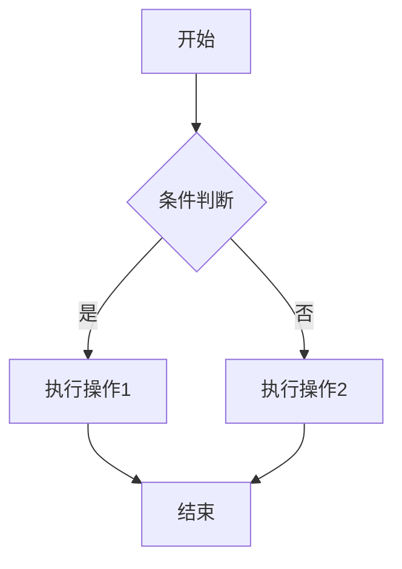

# VitePress博客搭建完整教程

VitePress是Vue官方团队开发的静态站点生成器，基于Vite构建，专为技术文档和博客设计。本文将详细介绍如何使用VitePress搭建个人技术博客。

## 一、VitePress简介

### 1.1 什么是VitePress

VitePress是一个基于Vite和Vue的静态站点生成器，具有以下特点：

- **极速开发体验**：基于Vite，提供毫秒级的热更新
- **Vue驱动**：可以使用Vue组件扩展功能
- **Markdown增强**：支持Markdown中嵌入Vue组件
- **自动路由**：根据文件结构自动生成路由
- **主题定制**：默认主题可深度定制

### 1.2 与其他工具对比

| 特性 | VitePress | VuePress | Next.js |
|------|-----------|----------|---------|
| 构建工具 | Vite | Webpack | Webpack/Vite |
| 开发速度 | 极快 | 较慢 | 中等 |
| Vue版本 | Vue 3 | Vue 2 | 可选 |
| 学习曲线 | 低 | 中 | 高 |
| 适合场景 | 文档/博客 | 文档 | 全栈应用 |

## 二、快速开始

### 2.1 环境准备

```bash
# 确保Node.js版本 >= 18
node -v

# 创建项目目录
mkdir my-blog
cd my-blog

# 初始化项目
npm init -y
```

### 2.2 安装VitePress

```bash
# 安装VitePress
npm install -D vitepress

# 初始化VitePress
npx vitepress init
```

初始化时会询问以下问题：

```
Where should VitePress initialize the config?
  > ./docs

Where should the site's markdown sources live?
  > ./docs

Site title:
  > My Tech Blog

Site description:
  > A personal technical blog built with VitePress

Use a custom theme?
  > Default Theme

Add npm scripts to package.json?
  > Yes
```

### 2.3 项目结构

初始化后的项目结构：

```
my-blog/
├── docs/
│   ├── .vitepress/
│   │   └── config.mts    # VitePress配置文件
│   ├── index.md          # 首页
│   └── about.md          # 关于页面
├── package.json
└── node_modules/
```

### 2.4 启动开发服务器

```bash
# 启动开发模式
npm run docs:dev

# 访问 http://localhost:5173
```

## 三、配置详解

### 3.1 基础配置

```typescript
// docs/.vitepress/config.mts
import { defineConfig } from 'vitepress'

export default defineConfig({
  // 站点元信息
  title: '我的技术博客',
  description: '记录技术学习和思考',
  lang: 'zh-CN',
  
  // 站点基础路径（部署时需要）
  base: '/',
  
  // 头部元信息
  head: [
    ['meta', { name: 'author', content: 'Your Name' }],
    ['meta', { name: 'keywords', content: '技术博客,前端,Vue' }],
    ['link', { rel: 'icon', href: '/favicon.ico' }]
  ],
  
  // Markdown配置
  markdown: {
    lineNumbers: true,           // 显示行号
    math: true,                  // 数学公式支持
    imageLazyLoading: true       // 图片懒加载
  },
  
  // 构建配置
  build: {
    outDir: '../dist',           // 输出目录
    cacheDir: '../.vitepress-cache'
  }
})
```

### 3.2 主题配置

```typescript
// docs/.vitepress/config.mts
export default defineConfig({
  themeConfig: {
    // 网站Logo
    logo: '/logo.svg',
    
    // 网站标题
    siteTitle: '技术博客',
    
    // 导航栏
    nav: [
      { text: '首页', link: '/' },
      { text: '博客', link: '/blog/' },
      { text: '教程', link: '/tutorials/' },
      {
        text: '更多',
        items: [
          { text: '关于', link: '/about' },
          { text: 'GitHub', link: 'https://github.com/yourname' }
        ]
      }
    ],
    
    // 侧边栏
    sidebar: {
      '/blog/': [
        {
          text: '技术文章',
          collapsed: false,
          items: [
            { text: 'Vue3响应式原理', link: '/blog/vue3-reactivity' },
            { text: 'TypeScript高级类型', link: '/blog/typescript-types' }
          ]
        },
        {
          text: '教程指南',
          collapsed: true,
          items: [
            { text: 'Vue3项目搭建', link: '/blog/vue3-setup' }
          ]
        }
      ],
      '/tutorials/': [
        {
          text: '入门教程',
          items: [
            { text: '快速开始', link: '/tutorials/quick-start' },
            { text: '基础概念', link: '/tutorials/basics' }
          ]
        }
      ]
    },
    
    // 社交链接
    socialLinks: [
      { icon: 'github', link: 'https://github.com/yourname' },
      { icon: 'twitter', link: 'https://twitter.com/yourname' }
    ],
    
    // 页脚
    footer: {
      message: '基于 VitePress 构建',
      copyright: 'Copyright © 2025-present Your Name'
    },
    
    // 编辑链接
    editLink: {
      pattern: 'https://github.com/yourname/blog/edit/main/docs/:path',
      text: '在GitHub上编辑此页'
    },
    
    // 最后更新时间
    lastUpdated: {
      text: '最后更新于',
      formatOptions: {
        dateStyle: 'short',
        timeStyle: 'short'
      }
    },
    
    // 文档页脚
    docFooter: {
      prev: '上一页',
      next: '下一页'
    },
    
    // 大纲配置
    outline: {
      level: [2, 3],
      label: '页面导航'
    },
    
    // 返回顶部
    returnToTopLabel: '返回顶部',
    
    // 搜索配置
    search: {
      provider: 'local'  // 本地搜索
    }
  }
})
```

### 3.3 多语言配置

```typescript
// docs/.vitepress/config.mts
export default defineConfig({
  locales: {
    root: {
      label: '简体中文',
      lang: 'zh-CN',
      themeConfig: {
        nav: [
          { text: '首页', link: '/' },
          { text: '博客', link: '/blog/' }
        ],
        sidebar: {
          '/blog/': [
            { text: '技术文章', items: [...] }
          ]
        }
      }
    },
    en: {
      label: 'English',
      lang: 'en-US',
      link: '/en/',
      themeConfig: {
        nav: [
          { text: 'Home', link: '/en/' },
          { text: 'Blog', link: '/en/blog/' }
        ],
        sidebar: {
          '/en/blog/': [
            { text: 'Tech Articles', items: [...] }
          ]
        }
      }
    }
  }
})
```

## 四、内容编写

### 4.1 首页配置

```markdown
<!-- docs/index.md -->
---
layout: home

hero:
  name: 技术博客
  text: 记录学习与思考
  tagline: Vue, TypeScript, 前端工程化
  image:
    src: /hero-image.svg
    alt: Hero Image
  actions:
    - theme: brand
      text: 开始阅读
      link: /blog/
    - theme: alt
      text: GitHub
      link: https://github.com/yourname

features:
  - icon: 🚀
    title: 极速体验
    details: 基于 Vite 构建，毫秒级热更新，开发体验极佳
  - icon: 💡
    title: Vue 驱动
    details: 在 Markdown 中使用 Vue 组件，享受 Vue 的开发体验
  - icon: 📦
    title: 开箱即用
    details: 默认主题优化，专注于内容创作，无需繁琐配置
---
```

### 4.2 文章模板

```markdown
<!-- docs/blog/vue3-reactivity.md -->
---
title: Vue3响应式原理深入理解
date: 2025-01-15
categories: [blog, tech-articles]
tags: [Vue3, 响应式, Proxy]
description: 深入剖析Vue3响应式系统的核心原理
author: Your Name
---

# Vue3响应式原理深入理解

## 一、响应式系统的演进

Vue3的响应式系统相比Vue2有了质的飞跃...

### 1.1 Vue2的实现

在Vue2中，响应式是通过 Object.defineProperty 实现的：

```javascript
function defineReactive(obj, key, val) {
  Object.defineProperty(obj, key, {
    get() {
      return val
    },
    set(newVal) {
      val = newVal
    }
  })
}
```

### 1.2 Vue3的Proxy方案

Vue3采用 Proxy 实现响应式：

```javascript
const reactive = (target) => {
  return new Proxy(target, {
    get(target, key) {
      track(target, key)
      return target[key]
    },
    set(target, key, value) {
      trigger(target, key)
      target[key] = value
      return true
    }
  })
}
```

## 二、核心概念

<!-- 更多内容 -->

## 总结

Vue3的响应式系统带来了更好的性能和更完善的功能支持。

::: tip 提示
建议在实际项目中多使用组合式API，发挥响应式系统的最大优势。
:::

::: warning 注意
注意避免在响应式对象中直接解构，会丢失响应性。
:::

::: danger 危险
不要在 setup 函数外创建响应式对象，可能导致内存泄漏。
:::
```

### 4.3 Frontmatter规范

```yaml
---
title: 文章标题                 # 必需
date: 2025-01-15               # 发布日期
categories: [blog, category]   # 分类
tags: [Vue3, TypeScript]       # 标签
description: 文章简短描述       # SEO描述
author: 作者名                  # 作者
image: /cover.jpg              # 封面图
layout: doc                    # 布局方式
draft: false                   # 是否草稿
---
```

### 4.4 Markdown扩展语法

VitePress支持丰富的Markdown扩展：

**自定义容器**

```markdown
::: info
这是一个信息容器
:::

::: tip 提示
这是一个提示容器
:::

::: warning 注意
这是一个警告容器
:::

::: danger 危险
这是一个危险容器
:::

::: details 点击展开
这是可折叠的详细内容
:::
```

**代码组**

```markdown
::: code-group
```npm
npm install vitepress
```

```yarn
yarn add vitepress
```

```pnpm
pnpm add vitepress
```
:::
```

**数学公式**

```markdown
行内公式：$E = mc^2$

块级公式：

$$
\frac{\partial f}{\partial x} = \lim_{h \to 0} \frac{f(x+h) - f(x)}{h}
$$
```

**图表**

```markdown

```

## 五、主题定制

### 5.1 自定义CSS

```css
/* docs/.vitepress/theme/style.css */
:root {
  /* 主色调 */
  --vp-c-brand-1: #42b883;
  --vp-c-brand-2: #35495e;
  --vp-c-brand-3: #42b883;
  
  /* 文字颜色 */
  --vp-c-text-1: rgba(60, 60, 67);
  --vp-c-text-2: rgba(60, 60, 67, 0.78);
  --vp-c-text-3: rgba(60, 60, 67, 0.56);
  
  /* 背景颜色 */
  --vp-c-bg: #ffffff;
  --vp-c-bg-soft: #f6f6f7;
  --vp-c-bg-mute: #f1f1f1;
  
  /* 边框颜色 */
  --vp-c-border: rgba(60, 60, 67, 0.29);
  
  /* 代码块背景 */
  --vp-code-bg: #f6f6f7;
}

/* 暗色模式 */
.dark {
  --vp-c-bg: #1b1b1f;
  --vp-c-bg-soft: #161618;
  --vp-c-bg-mute: #161618;
}

/* 自定义组件样式 */
.VPHero {
  .name {
    font-size: 48px;
    font-weight: bold;
  }
  
  .tagline {
    font-size: 24px;
    color: var(--vp-c-text-2);
  }
}

/* 自定义容器样式 */
.custom-block {
  border-radius: 8px;
  padding: 16px;
  
  &.tip {
    background-color: rgba(66, 184, 131, 0.1);
  }
}
```

### 5.2 自定义主题组件

```typescript
// docs/.vitepress/theme/index.ts
import DefaultTheme from 'vitepress/theme'
import type { Theme } from 'vitepress'
import './style.css'
import MyLayout from './components/MyLayout.vue'
import BlogList from './components/BlogList.vue'
import CommentSection from './components/CommentSection.vue'

export default {
  extends: DefaultTheme,
  
  Layout: MyLayout,
  
  enhanceApp({ app }) {
    // 注册全局组件
    app.component('BlogList', BlogList)
    app.component('CommentSection', CommentSection)
    
    // 注册全局指令
    app.directive('focus', {
      mounted(el) {
        el.focus()
      }
    })
  },
  
  setup() {
    // 全局设置
  }
} satisfies Theme
```

### 5.3 自定义布局组件

```vue
<!-- docs/.vitepress/theme/components/MyLayout.vue -->
<script setup lang="ts">
import DefaultTheme from 'vitepress/theme'
import { useData } from 'vitepress'
import BlogFooter from './BlogFooter.vue'

const { frontmatter } = useData()
const DefaultLayout = DefaultTheme.Layout
</script>

<template>
  <DefaultLayout>
    <!-- 自定义页面顶部 -->
    <template #doc-top>
      <div v-if="frontmatter.layout === 'blog'" class="blog-header">
        <h1>{{ frontmatter.title }}</h1>
        <div class="meta">
          <span>{{ frontmatter.date }}</span>
          <span>{{ frontmatter.author }}</span>
        </div>
      </div>
    </template>
    
    <!-- 自定义内容底部 -->
    <template #doc-after>
      <CommentSection v-if="frontmatter.layout === 'blog'" />
    </template>
    
    <!-- 自定义页脚 -->
    <template #layout-bottom>
      <BlogFooter />
    </template>
  </DefaultLayout>
</template>

<style scoped>
.blog-header {
  padding: 24px 0;
  border-bottom: 1px solid var(--vp-c-divider);
}

.blog-header h1 {
  font-size: 32px;
  font-weight: 600;
}

.blog-header .meta {
  margin-top: 12px;
  color: var(--vp-c-text-2);
}

.blog-header .meta span {
  margin-right: 16px;
}
</style>
```

### 5.4 博客列表组件

```vue
<!-- docs/.vitepress/theme/components/BlogList.vue -->
<script setup lang="ts">
import { useData } from 'vitepress'
import { computed } from 'vue'

interface Post {
  title: string
  url: string
  date: string
  tags: string[]
  description: string
}

const posts: Post[] = [
  {
    title: 'Vue3响应式原理深入理解',
    url: '/blog/vue3-reactivity',
    date: '2025-01-15',
    tags: ['Vue3', '响应式'],
    description: '深入剖析Vue3响应式系统的核心原理'
  },
  {
    title: 'TypeScript高级类型技巧',
    url: '/blog/typescript-types',
    date: '2025-02-08',
    tags: ['TypeScript', '类型系统'],
    description: '深入探讨TypeScript高级类型技巧'
  }
]

const sortedPosts = computed(() => {
  return posts.sort((a, b) => 
    new Date(b.date).getTime() - new Date(a.date).getTime()
  )
})
</script>

<template>
  <div class="blog-list">
    <article v-for="post in sortedPosts" :key="post.url" class="blog-item">
      <a :href="post.url">
        <h2>{{ post.title }}</h2>
        <p class="description">{{ post.description }}</p>
        <div class="meta">
          <span class="date">{{ post.date }}</span>
          <span v-for="tag in post.tags" :key="tag" class="tag">
            {{ tag }}
          </span>
        </div>
      </a>
    </article>
  </div>
</template>

<style scoped>
.blog-list {
  display: grid;
  gap: 24px;
}

.blog-item {
  padding: 24px;
  border-radius: 12px;
  background: var(--vp-c-bg-soft);
  transition: all 0.3s;
}

.blog-item:hover {
  background: var(--vp-c-bg-mute);
  transform: translateY(-2px);
}

.blog-item h2 {
  font-size: 20px;
  font-weight: 600;
  margin-bottom: 8px;
}

.blog-item .description {
  color: var(--vp-c-text-2);
  margin-bottom: 12px;
}

.blog-item .meta {
  display: flex;
  gap: 12px;
  align-items: center;
}

.blog-item .tag {
  padding: 4px 8px;
  border-radius: 4px;
  background: var(--vp-c-brand-1);
  color: white;
  font-size: 12px;
}
</style>
```

## 六、搜索集成

### 6.1 本地搜索

```typescript
// docs/.vitepress/config.mts
export default defineConfig({
  themeConfig: {
    search: {
      provider: 'local',
      options: {
        translations: {
          button: {
            buttonText: '搜索文档',
            buttonAriaLabel: '搜索文档'
          },
          modal: {
            noResultsText: '没有找到结果',
            resetButtonTitle: '清除查询条件',
            footer: {
              selectText: '选择',
              navigateText: '切换'
            }
          }
        }
      }
    }
  }
})
```

### 6.2 Algolia搜索

```typescript
// docs/.vitepress/config.mts
export default defineConfig({
  themeConfig: {
    search: {
      provider: 'algolia',
      options: {
        appId: 'YOUR_APP_ID',
        apiKey: 'YOUR_API_KEY',
        indexName: 'YOUR_INDEX_NAME',
        locales: {
          zh: {
            placeholder: '搜索文档',
            translations: {
              button: {
                buttonText: '搜索文档'
              }
            }
          }
        }
      }
    }
  }
})
```

申请Algolia DocSearch：

1. 访问 https://docsearch.algolia.com/
2. 提交申请表单
3. 等待审核（通常需要几天）
4. 收到配置信息后更新配置

## 七、评论系统

### 7.1 Giscus集成

```vue
<!-- docs/.vitepress/theme/components/Giscus.vue -->
<script setup lang="ts">
import giscusTalk from 'giscus'
import { useData } from 'vitepress'

const { frontmatter } = useData()

giscusTalk({
  repo: 'yourname/blog-comments',
  repoId: 'YOUR_REPO_ID',
  category: 'Announcements',
  categoryId: 'YOUR_CATEGORY_ID',
  mapping: 'pathname',
  term: frontmatter.title,
  reactionsEnabled: '1',
  emitMetadata: '0',
  inputPosition: 'top',
  theme: 'light',
  lang: 'zh-CN',
  loading: 'lazy'
})
</script>

<template>
  <div class="giscus-container">
    <div class="giscus"></div>
  </div>
</template>
```

### 7.2 条件渲染评论

```vue
<!-- docs/.vitepress/theme/index.ts -->
import Giscus from './components/Giscus.vue'

export default {
  extends: DefaultTheme,
  
  enhanceApp({ app }) {
    app.component('Giscus', Giscus)
  },
  
  setup() {
    const { frontmatter } = useData()
    
    // 只在博客文章页面显示评论
    if (frontmatter.value.layout === 'blog') {
      return {
        showComments: true
      }
    }
  }
}
```

## 八、部署发布

### 8.1 构建配置

```typescript
// docs/.vitepress/config.mts
export default defineConfig({
  // 输出到根目录的dist文件夹
  build: {
    outDir: '../dist',
    cleanOutDir: true
  },
  
  // 生成站点地图
  sitemap: {
    hostname: 'https://yourblog.com'
  }
})
```

### 8.2 GitHub Pages部署

```yaml
# .github/workflows/deploy.yml
name: Deploy VitePress site to Pages

on:
  push:
    branches: [main]

permissions:
  contents: read
  pages: write
  id-token: write

concurrency:
  group: pages
  cancel-in-progress: false

jobs:
  build:
    runs-on: ubuntu-latest
    steps:
      - name: Checkout
        uses: actions/checkout@v4
        
      - name: Setup Node
        uses: actions/setup-node@v4
        with:
          node-version: 18
          cache: npm
          
      - name: Setup Pages
        uses: actions/configure-pages@v4
        
      - name: Install dependencies
        run: npm ci
        
      - name: Build with VitePress
        run: npm run docs:build
        
      - name: Upload artifact
        uses: actions/upload-pages-artifact@v3
        with:
          path: dist
          
  deploy:
    environment:
      name: github-pages
      url: ${{ steps.deployment.outputs.page_url }}
    needs: build
    runs-on: ubuntu-latest
    steps:
      - name: Deploy to GitHub Pages
        id: deployment
        uses: actions/deploy-pages@v4
```

### 8.3 Vercel部署

```bash
# 安装Vercel CLI
npm install -g vercel

# 部署
vercel --prod
```

或者在Vercel网站配置：

1. 导入GitHub仓库
2. Framework Preset选择VitePress
3. Build Command: `npm run docs:build`
4. Output Directory: `dist`
5. 点击Deploy

### 8.4 自托管部署

```bash
# 构建
npm run docs:build

# 使用nginx托管静态文件
# nginx.conf
server {
  listen 80;
  server_name yourblog.com;
  
  root /var/www/blog/dist;
  index index.html;
  
  location / {
    try_files $uri $uri/ /index.html;
  }
  
  # 缓存静态资源
  location ~* \.(js|css|png|jpg|jpeg|gif|ico|svg|woff|woff2)$ {
    expires 1y;
    add_header Cache-Control "public, immutable";
  }
}
```

## 九、SEO优化

### 9.1 元信息优化

```typescript
// docs/.vitepress/config.mts
export default defineConfig({
  head: [
    // 基础SEO
    ['meta', { name: 'description', content: '您的博客描述' }],
    ['meta', { name: 'keywords', content: 'Vue,TypeScript,前端,博客' }],
    
    // Open Graph
    ['meta', { property: 'og:type', content: 'website' }],
    ['meta', { property: 'og:title', content: '您的博客标题' }],
    ['meta', { property: 'og:description', content: '您的博客描述' }],
    ['meta', { property: 'og:image', content: '/og-image.png' }],
    
    // Twitter Card
    ['meta', { name: 'twitter:card', content: 'summary_large_image' }],
    ['meta', { name: 'twitter:title', content: '您的博客标题' }],
    ['meta', { name: 'twitter:description', content: '您的博客描述' }]
  ]
})
```

### 9.2 结构化数据

```vue
<!-- docs/.vitepress/theme/components/StructuredData.vue -->
<script setup lang="ts">
import { useData } from 'vitepress'

const { frontmatter, page } = useData()

const structuredData = {
  '@context': 'https://schema.org',
  '@type': 'BlogPosting',
  headline: frontmatter.title,
  description: frontmatter.description,
  datePublished: frontmatter.date,
  author: {
    '@type': 'Person',
    name: frontmatter.author || 'Your Name'
  },
  publisher: {
    '@type': 'Organization',
    name: 'Your Blog',
    logo: {
      '@type': 'ImageObject',
      url: '/logo.png'
    }
  }
}
</script>

<template>
  <component :is="'script'" type="application/ld+json">
    {{ JSON.stringify(structuredData) }}
  </component>
</template>
```

## 十、总结

搭建VitePress博客的主要步骤：

**环境准备**：安装Node.js和VitePress，初始化项目结构。

**配置定制**：根据需求配置导航栏、侧边栏、主题样式等。

**内容编写**：遵循Frontmatter规范，使用Markdown扩展语法。

**主题扩展**：开发自定义组件，扩展默认主题功能。

**搜索集成**：选择本地搜索或Algolia搜索，提升用户体验。

**评论系统**：集成Giscus等评论系统，增强互动性。

**部署发布**：选择GitHub Pages、Vercel或自托管方式部署。

**SEO优化**：完善元信息和结构化数据，提高搜索引擎排名。

VitePress的简洁设计让它成为搭建技术博客的理想选择。通过本文的指导，你已经掌握了搭建完整VitePress博客的核心技能，可以根据自己的需求进一步定制和扩展。

## 参考资料

- VitePress官方文档：https://vitepress.dev/
- Vue官方文档：https://vuejs.org/
- Algolia DocSearch：https://docsearch.algolia.com/
- Giscus评论系统：https://giscus.app/
- GitHub Pages文档：https://docs.github.com/pages